0. 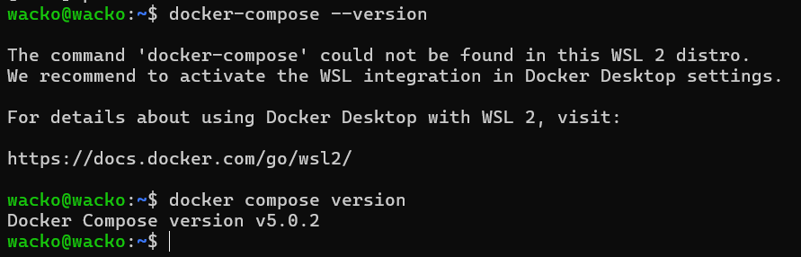
1. 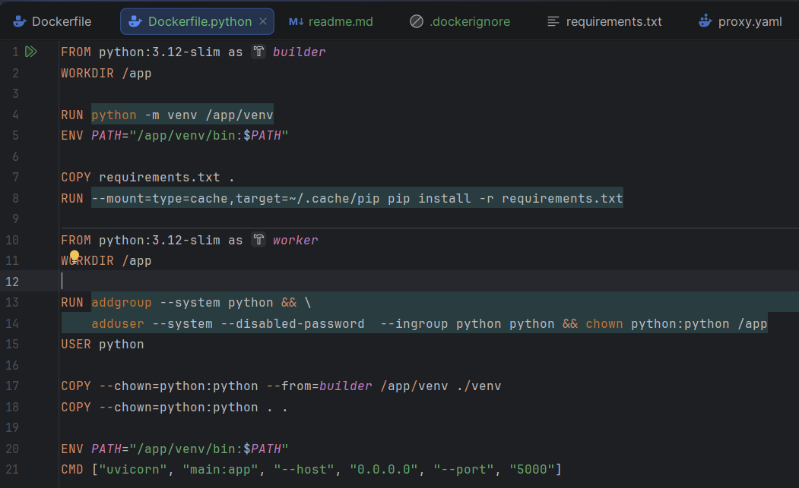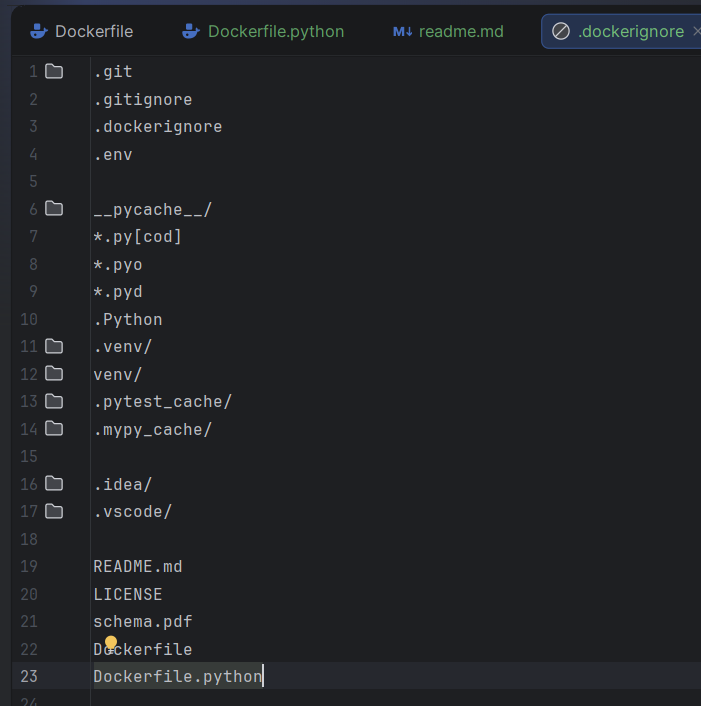
2. 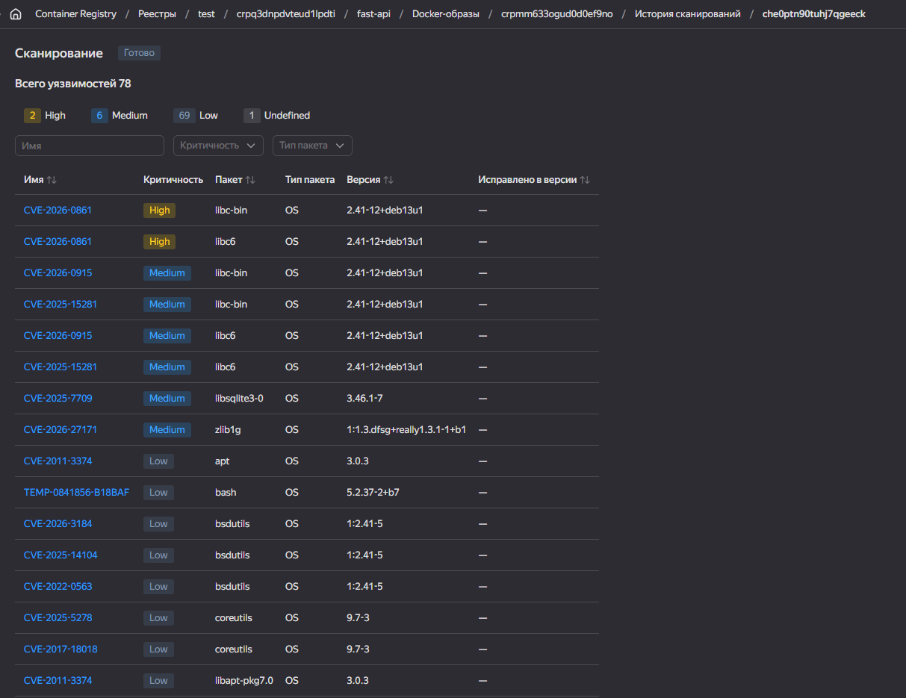
3. не понял, как я должен был делать curl к 8090 порту, если в proxy.yaml прокинуты 8080, т.к указано что начальные файлы редактировать запрещено, сделал курл к 8080 получил время и ошибку про IP, но таблица создалась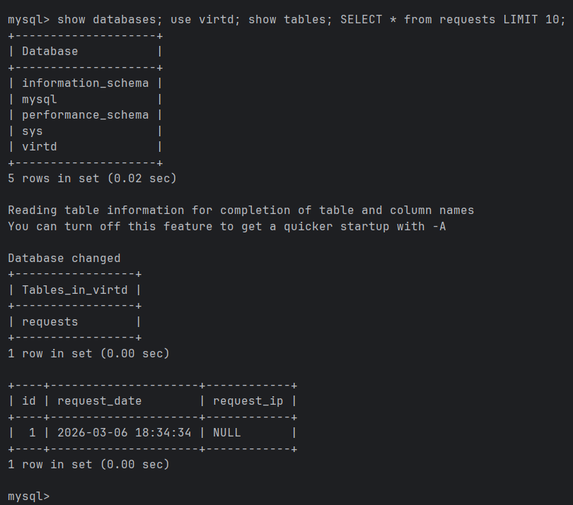
4. был удивлен, что если обращаться к 8090 порту контейнера, который поднят на сервере, то все проходит успешно, хотя в конфиге все еще 8080 прокинут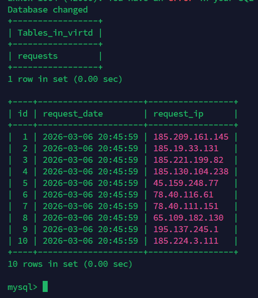 https://github.com/wacko-io/shvirtd-example-python
5.
```
#!/bin/bash
set -euo pipefail

cd /opt/shvirtd-example-python

set -a
source /opt/shvirtd-example-python/.env
set +a

mkdir -p /opt/backup
timestamp=$(date +%Y%m%d_%H%M%S)
docker run --rm --network shvirtd-example-python_backend mysql:8.0 mysqldump -h db -u root -p"$MYSQL_ROOT_PASSWORD" --all-databases > /opt/backup/backup_${timestamp}.sql
```
```
*/1 * * * * /opt/shvirtd-example-python/backup.sh
```
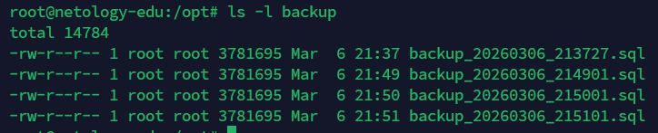
6. 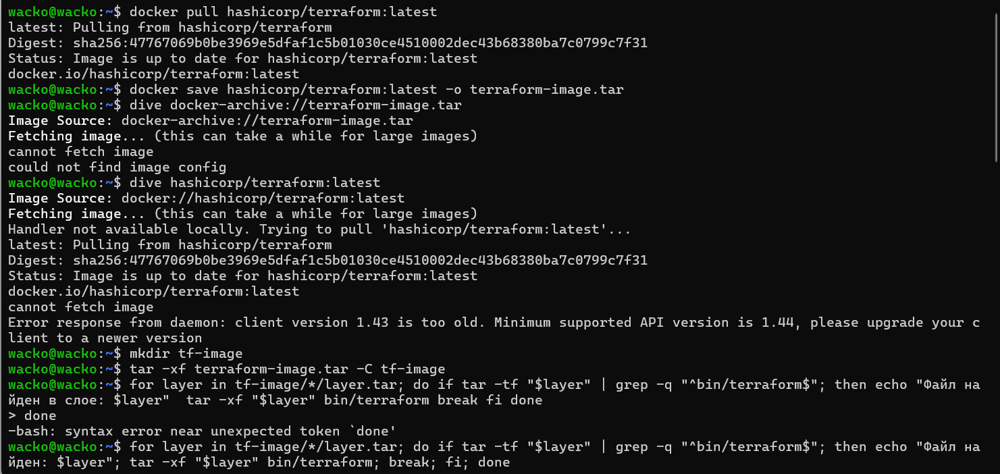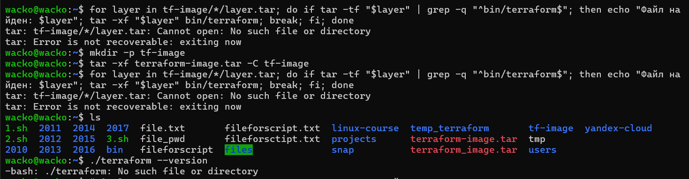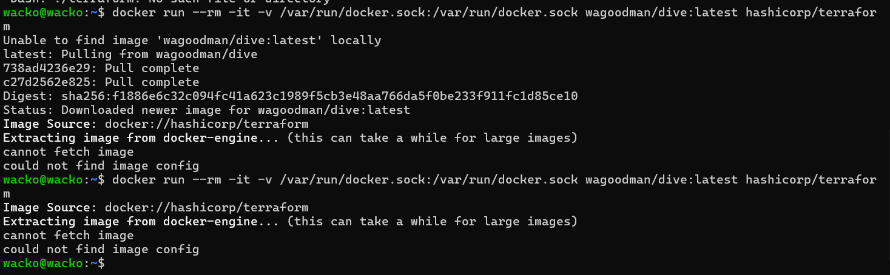
6.1 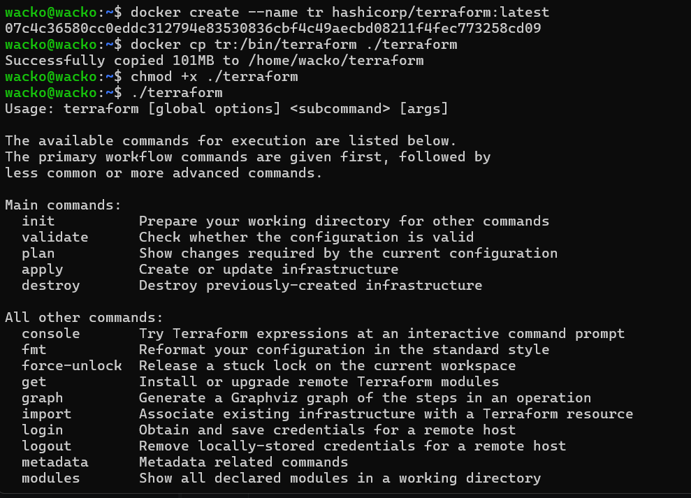
6.2
```
FROM hashicorp/terraform:latest AS source
FROM scratch
COPY --from=source /bin/terraform /
```
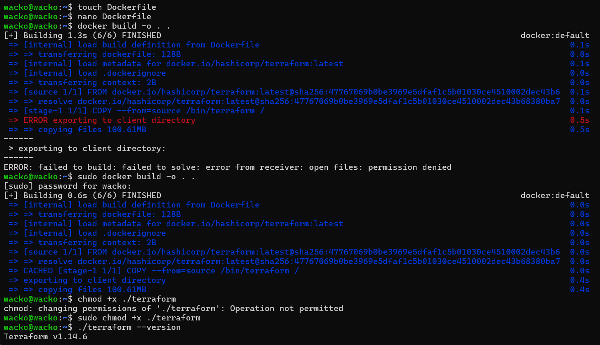
7. 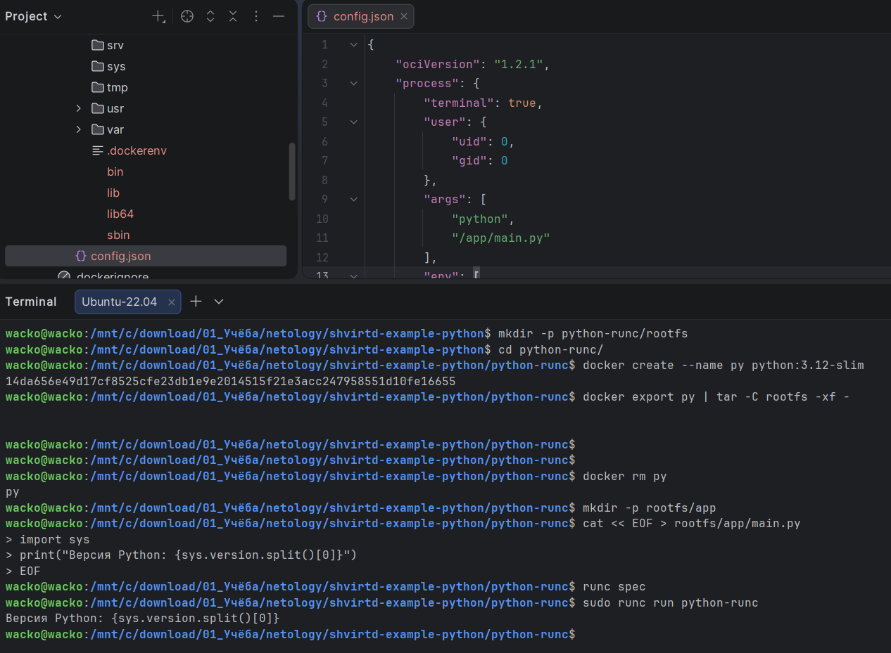