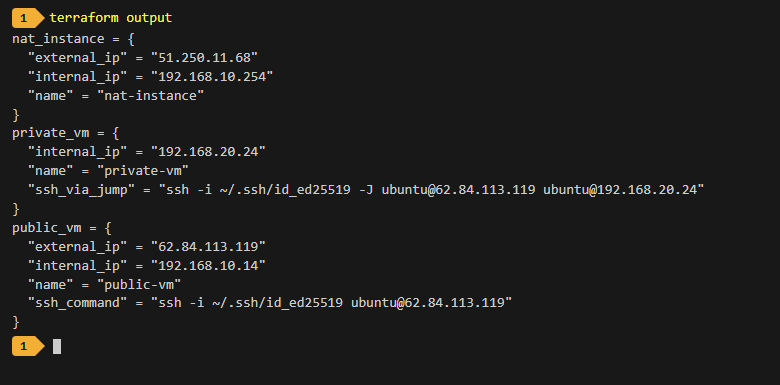
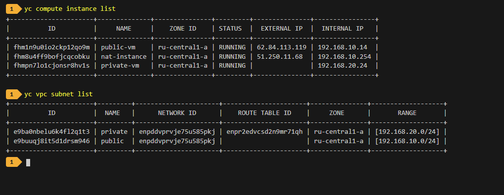
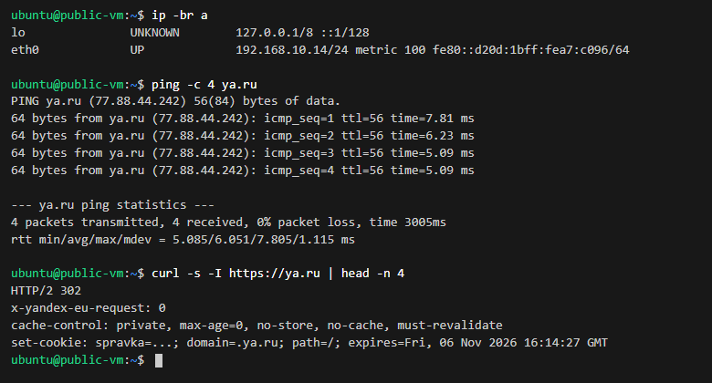
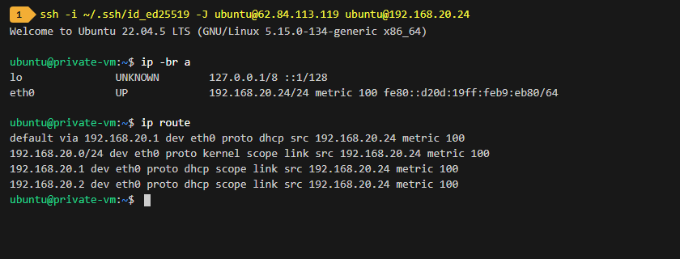
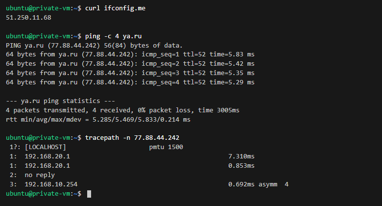
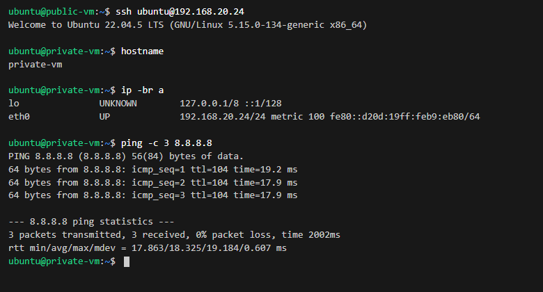

# Задание 1. Yandex Cloud (VPC, NAT-инстанс, Публичная и Приватная подсети)

## Описание задания
В рамках выполнения домашнего задания развернута следующая инфраструктура в **Yandex Cloud** с использованием **Terraform**:
1. **VPC Network**: пустая сеть `netology-vpc`.
2. **Публичная подсеть (`public`)**:
   - CIDR: `192.168.10.0/24`.
   - **NAT-инстанс**: образ `fd80mrhj8fl2oe87o4e1` (nat-instance-ubuntu), статический внутренний IP `192.168.10.254`, публичный IP (`nat = true`).
   - **Публичная виртуальная машина (`public-vm`)**: Ubuntu 22.04 LTS с публичным IP для роли Bastion / Jump Host.
3. **Приватная подсеть (`private`)**:
   - CIDR: `192.168.20.0/24`.
   - **Таблица маршрутизации (`nat-route-table`)**: статический маршрут по умолчанию `0.0.0.0/0` через NAT-инстанс (`192.168.10.254`). Привязана к приватной подсети.
   - **Приватная виртуальная машина (`private-vm`)**: Ubuntu 22.04 LTS только с внутренним IP (`nat = false`).

---

## Результат выполнения terraform apply и terraform output

Вывод команды `terraform output` в консоли:



```text
nat_instance = {
  "external_ip" = "51.250.11.68"
  "internal_ip" = "192.168.10.254"
  "name" = "nat-instance"
}
private_vm = {
  "internal_ip" = "192.168.20.24"
  "name" = "private-vm"
  "ssh_via_jump" = "ssh -i ~/.ssh/id_ed25519 -J ubuntu@62.84.113.119 ubuntu@192.168.20.24"
}
public_vm = {
  "external_ip" = "62.84.113.119"
  "internal_ip" = "192.168.10.14"
  "name" = "public-vm"
  "ssh_command" = "ssh -i ~/.ssh/id_ed25519 ubuntu@62.84.113.119"
}
```

---

## Верификация ресурсов в Yandex Cloud через CLI

Проверка созданных инстансов и подсетей через `yc compute instance list` и `yc vpc subnet list`:



---

## Тестирование и верификация через консоль

### 1. Проверка публичной ВМ (`public-vm`)
Подключение по прямому публичному IP `62.84.113.119`, проверка внутреннего IP (`192.168.10.14/24`) и доступности интернета (`ping`, `curl`):



```text
ubuntu@public-vm:~$ ip -br a
eth0             UP             192.168.10.14/24

ubuntu@public-vm:~$ ping -c 4 ya.ru
4 packets transmitted, 4 received, 0% packet loss, time 3005ms
rtt min/avg/max/mdev = 5.085/6.051/7.805/1.115 ms

ubuntu@public-vm:~$ curl -s -I https://ya.ru | head -n 4
HTTP/2 302
```

### 2. Подключение к приватной ВМ (`private-vm`) через `public-vm` (Jump Host)
Подключение через `ProxyJump` с локальной рабочей станции (`ssh -J ...`), проверка сетевого интерфейса (только внутренний адрес `192.168.20.24`, публичный IP отсутствует) и таблицы маршрутизации ядра:



```text
ubuntu@private-vm:~$ ip -br a
eth0             UP             192.168.20.24/24

ubuntu@private-vm:~$ ip route
default via 192.168.20.1 dev eth0 proto dhcp src 192.168.20.24 metric 100 
192.168.20.0/24 dev eth0 proto kernel scope link src 192.168.20.24 metric 100 
```

### 3. Проверка приватной ВМ и маршрутизации через NAT-инстанс
Проверка выхода `private-vm` в интернет через шлюз NAT:
- `curl ifconfig.me` возвращает **`51.250.11.68`** (внешний IP NAT-инстанса).
- `ping ya.ru` проходит успешно с 0% потерь.
- `tracepath` подтверждает, что весь исходящий трафик направляется через узел **`192.168.10.254`** (NAT-инстанс):



```text
ubuntu@private-vm:~$ curl ifconfig.me
51.250.11.68

ubuntu@private-vm:~$ ping -c 4 ya.ru
4 packets transmitted, 4 received, 0% packet loss

ubuntu@private-vm:~$ tracepath -n 77.88.44.242
 1:  192.168.20.1
 3:  192.168.10.254
```

### 4. Прямой SSH-доступ с Public VM на Private VM
Интерактивное подключение изнутри `public-vm` к `private-vm` по внутреннему IP `192.168.20.24` и проверка доступности внешних ресурсов:



```text
ubuntu@public-vm:~$ ssh ubuntu@192.168.20.24
ubuntu@private-vm:~$ hostname
private-vm
ubuntu@private-vm:~$ ip -br a
eth0             UP             192.168.20.24/24
ubuntu@private-vm:~$ ping -c 3 8.8.8.8
3 packets transmitted, 3 received, 0% packet loss, time 2002ms
rtt min/avg/max/mdev = 17.863/18.325/19.184/0.607 ms
```

---

## Выводы
1. Все требования задания выполнены в полном объеме:
   - Создана пустая VPC `netology-vpc`.
   - Создана публичная подсеть `192.168.10.0/24` с NAT-инстансом (образ `fd80mrhj8fl2oe87o4e1`, IP `192.168.10.254`) и публичной ВМ.
   - Создана приватная подсеть `192.168.20.0/24` с таблицей маршрутизации `0.0.0.0/0 -> 192.168.10.254` и приватной ВМ.
2. Подтверждена сетевая связность и изоляция:
   - Приватная машина изолирована от прямого доступа извне.
   - Доступ на нее осуществляется через бастион (публичную ВМ).
   - Выход из приватной подсети в интернет осуществляется исключительно через NAT-инстанс (что подтверждено внешним IP `51.250.11.68` и трассировкой хопов).
