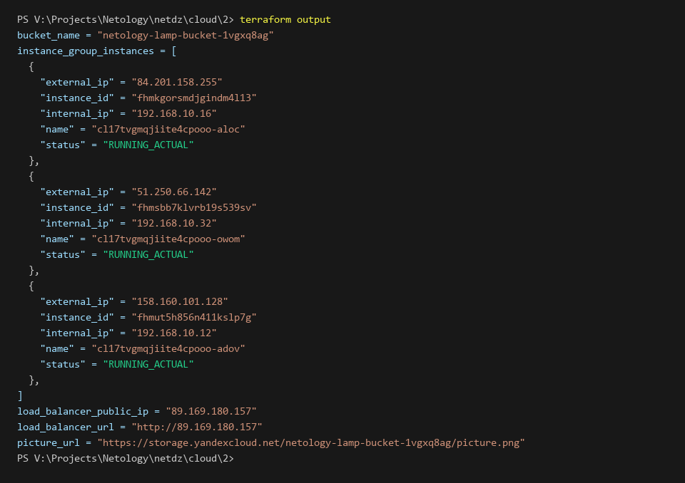
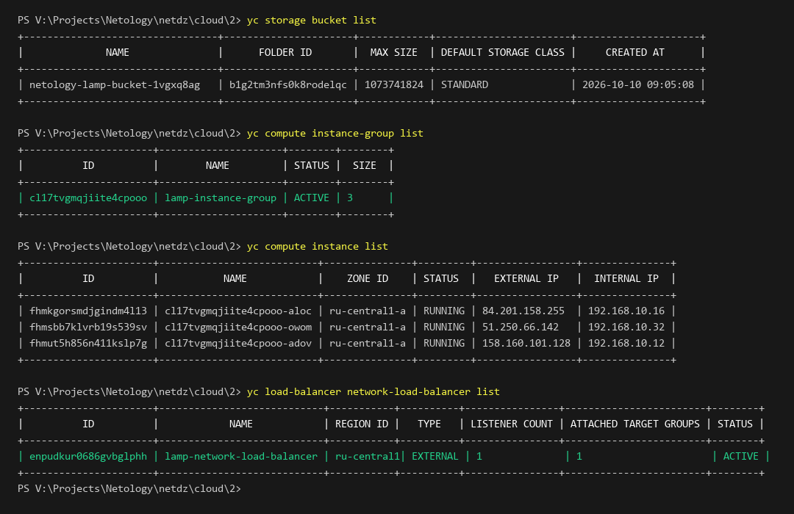
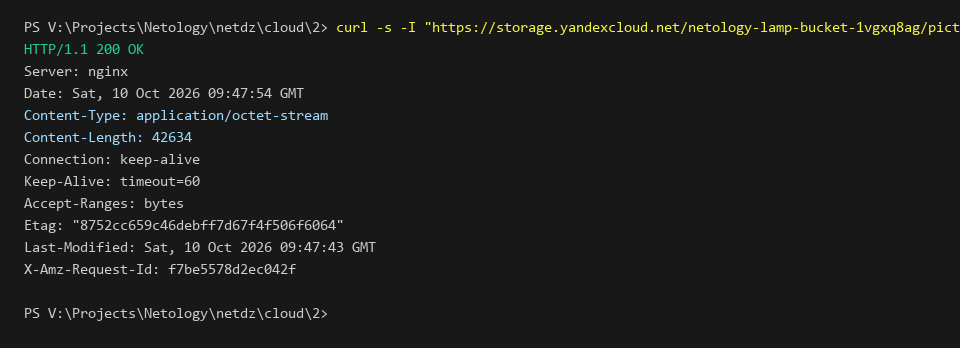
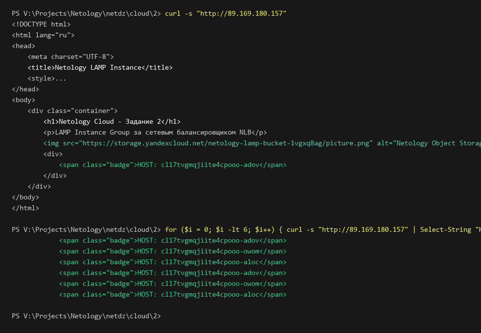
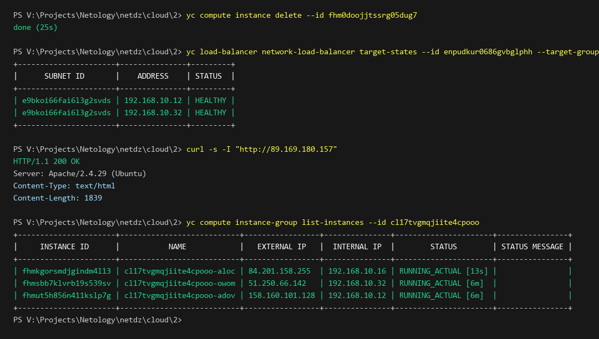

# Задание 2. Yandex Cloud (Бакет Object Storage, Instance Group LAMP, Сетевой балансировщик)

## Описание задания

В рамках выполнения домашнего задания развернута отказоустойчивая веб-инфраструктура в **Yandex Cloud** с использованием **Terraform**:

1. **Object Storage (S3-совместимое объектное хранилище)**:
   - Создан бакет Object Storage `netology-lamp-bucket-1vgxq8ag` со случайным уникальным суффиксом.
   - В бакет загружен графический файл `picture.png`.
   - Настроен публичный доступ из интернета (`anonymous_access_flags { read = true }` и `acl = "public-read"`).
2. **Сеть и подсеть**:
   - VPC-сеть `netology-vpc-2`.
   - Публичная подсеть `public` (`192.168.10.0/24`) в зоне доступности `ru-central1-a`.
3. **Группа виртуальных машин (Compute Instance Group)**:
   - Развернута группа фиксированного размера из 3 ВМ с шаблоном LAMP (`image_id = fd827b91d99psvq5fjit`).
   - Стартовая веб-страница настроена через `cloud-init` в блоке `metadata.user-data`.
   - В веб-страницу внедрен тег `` со ссылкой на картинку из созданного бакета Object Storage, а также отображение хостнейма текущего узла.
   - Настроена автоматическая проверка состояния (Health Check) по HTTP на порту 80 с путем `/`.
4. **Сетевой балансировщик (Network Load Balancer)**:
   - Создан внешний сетевой балансировщик с публичным IP `89.169.180.157`.
   - Подключена целевая группа ВМ `lamp-target-group`.
   - Проверено распределение входящих запросов между всеми 3 инстансами.
   - Проведена проверка отказоустойчивости: при удалении одной ВМ балансировщик исключает ее из пула без прерывания обслуживания, а Instance Group автоматически создает новую ВМ взамен удаленной (Self-healing).

---

## Результат выполнения terraform apply и terraform output

Вывод команды `terraform output` в консоли:



```text
bucket_name = "netology-lamp-bucket-1vgxq8ag"
instance_group_instances = [
  {
    "external_ip" = "84.201.158.255"
    "instance_id" = "fhmkgorsmdjgindm4l13"
    "internal_ip" = "192.168.10.16"
    "name" = "cl17tvgmqjiite4cpooo-aloc"
    "status" = "RUNNING_ACTUAL"
  },
  {
    "external_ip" = "51.250.66.142"
    "instance_id" = "fhmsbb7klvrb19s539sv"
    "internal_ip" = "192.168.10.32"
    "name" = "cl17tvgmqjiite4cpooo-owom"
    "status" = "RUNNING_ACTUAL"
  },
  {
    "external_ip" = "158.160.101.128"
    "instance_id" = "fhmut5h856n411kslp7g"
    "internal_ip" = "192.168.10.12"
    "name" = "cl17tvgmqjiite4cpooo-adov"
    "status" = "RUNNING_ACTUAL"
  },
]
load_balancer_public_ip = "89.169.180.157"
load_balancer_url = "http://89.169.180.157"
picture_url = "https://storage.yandexcloud.net/netology-lamp-bucket-1vgxq8ag/picture.png"
```

---

## Верификация ресурсов в Yandex Cloud через CLI

Проверка созданного бакета, группы ВМ, отдельных инстансов и балансировщика через консольные утилиты `yc`:



```text
yc storage bucket list
+---------------------------------+----------------------+------------+-----------------------+---------------------+
|              NAME               |      FOLDER ID       |  MAX SIZE  | DEFAULT STORAGE CLASS |     CREATED AT      |
+---------------------------------+----------------------+------------+-----------------------+---------------------+
| netology-lamp-bucket-1vgxq8ag   | b1g2tm3nfs0k8rodelqc | 1073741824 | STANDARD              | 2026-10-10 09:05:08 |
+---------------------------------+----------------------+------------+-----------------------+---------------------+

yc compute instance-group list
+----------------------+---------------------+--------+--------+
|          ID          |        NAME         | STATUS |  SIZE  |
+----------------------+---------------------+--------+--------+
| cl17tvgmqjiite4cpooo | lamp-instance-group | ACTIVE | 3      |
+----------------------+---------------------+--------+--------+

yc compute instance list
+----------------------+---------------------------+---------------+---------+-----------------+---------------+
|          ID          |           NAME            |    ZONE ID    | STATUS  |   EXTERNAL IP   |  INTERNAL IP  |
+----------------------+---------------------------+---------------+---------+-----------------+---------------+
| fhmkgorsmdjgindm4l13 | cl17tvgmqjiite4cpooo-aloc | ru-central1-a | RUNNING | 84.201.158.255  | 192.168.10.16 |
| fhmsbb7klvrb19s539sv | cl17tvgmqjiite4cpooo-owom | ru-central1-a | RUNNING | 51.250.66.142   | 192.168.10.32 |
| fhmut5h856n411kslp7g | cl17tvgmqjiite4cpooo-adov | ru-central1-a | RUNNING | 158.160.101.128 | 192.168.10.12 |
+----------------------+---------------------------+---------------+---------+-----------------+---------------+

yc load-balancer network-load-balancer list
+----------------------+----------------------------+-----------+----------+----------------+------------------------+--------+
|          ID          |            NAME            | REGION ID |   TYPE   | LISTENER COUNT | ATTACHED TARGET GROUPS | STATUS |
+----------------------+----------------------------+-----------+----------+----------------+------------------------+--------+
| enpudkur0686gvbglphh | lamp-network-load-balancer | ru-central1| EXTERNAL | 1              | 1                      | ACTIVE |
+----------------------+----------------------------+-----------+----------+----------------+------------------------+--------+
```

---

## Тестирование и верификация через консоль

### 1. Проверка доступности картинки в Object Storage

Проверка HTTP-заголовков прямого запроса к картинке в бакете `https://storage.yandexcloud.net/netology-lamp-bucket-1vgxq8ag/picture.png`:



```text
curl -s -I "https://storage.yandexcloud.net/netology-lamp-bucket-1vgxq8ag/picture.png"
HTTP/1.1 200 OK
Server: nginx
Date: Sat, 10 Oct 2026 09:47:54 GMT
Content-Type: application/octet-stream
Content-Length: 42634
Connection: keep-alive
Keep-Alive: timeout=60
Accept-Ranges: bytes
Etag: "8752cc659c46debff7d67f4f506f6064"
Last-Modified: Sat, 10 Oct 2026 09:47:43 GMT
X-Amz-Request-Id: f7be5578d2ec042f
```

Файл доступен анонимно из публичного интернета, код ответа `200 OK`.

### 2. Проверка работы сетевого балансировщика и веб-страниц LAMP

Запрос к публичному IP балансировщика `http://89.169.180.157`:

- Возвращается HTML-страница, сформированная шаблоном LAMP.
- В страницу встроена ссылка на картинку из Object Storage.
- Серия запросов подтверждает распределение трафика (балансировку) между разными хостами группы (`cl17tvgmqjiite4cpooo-adov`, `cl17tvgmqjiite4cpooo-owom`, `cl17tvgmqjiite4cpooo-aloc`):



```text
curl -s "http://89.169.180.157"
<!DOCTYPE html>
<html lang="ru">
<head>
    <meta charset="UTF-8">
    <title>Netology LAMP Instance</title>
</head>
<body>
    <div class="container">
        <h1>Netology Cloud - Задание 2</h1>
        <p>LAMP Instance Group за сетевым балансировщиком NLB</p>
        
        <div>
            <span class="badge">HOST: cl17tvgmqjiite4cpooo-adov</span>
        </div>
    </div>
</body>
</html>

for ($i = 0; $i -lt 6; $i++) { curl -s "http://89.169.180.157" | Select-String "HOST:" }
            <span class="badge">HOST: cl17tvgmqjiite4cpooo-adov</span>
            <span class="badge">HOST: cl17tvgmqjiite4cpooo-owom</span>
            <span class="badge">HOST: cl17tvgmqjiite4cpooo-aloc</span>
            <span class="badge">HOST: cl17tvgmqjiite4cpooo-adov</span>
            <span class="badge">HOST: cl17tvgmqjiite4cpooo-owom</span>
            <span class="badge">HOST: cl17tvgmqjiite4cpooo-aloc</span>
```

### 3. Проверка отказоустойчивости и автовосстановления (Self-healing)

Для проверки удалена одна из ВМ группы (`fhm0doojjtssrg05dug7`):

1. Сетевой балансировщик исключил удаляемый узел из пула маршрутизации; в целевой группе остались только оставшиеся здоровые узлы (`192.168.10.12`, `192.168.10.32` со статусом `HEALTHY`).
2. Запросы к балансировщику `curl -s -I "http://89.169.180.157"` продолжают успешно возвращать `200 OK` без простоев.
3. Группа ВМ зафиксировала отклонение от целевого размера (2 из 3) и автоматически создала новую ВМ (`fhmkgorsmdjgindm4l13`), вернув размер группы к 3 активным узлам:



```text
yc compute instance delete --id fhm0doojjtssrg05dug7
done (25s)

yc load-balancer network-load-balancer target-states --id enpudkur0686gvbglphh --target-group-id enp83llfa1knqedqpk9f
+----------------------+---------------+---------+
|      SUBNET ID       |    ADDRESS    | STATUS  |
+----------------------+---------------+---------+
| e9bkoi66fai6l3g2svds | 192.168.10.12 | HEALTHY |
| e9bkoi66fai6l3g2svds | 192.168.10.32 | HEALTHY |
+----------------------+---------------+---------+

curl -s -I "http://89.169.180.157"
HTTP/1.1 200 OK
Server: Apache/2.4.29 (Ubuntu)
Content-Type: text/html
Content-Length: 1839

yc compute instance-group list-instances --id cl17tvgmqjiite4cpooo
+----------------------+---------------------------+-----------------+---------------+----------------------+----------------+
|     INSTANCE ID      |           NAME            |   EXTERNAL IP   |  INTERNAL IP  |        STATUS        | STATUS MESSAGE |
+----------------------+---------------------------+-----------------+---------------+----------------------+----------------+
| fhmkgorsmdjgindm4l13 | cl17tvgmqjiite4cpooo-aloc | 84.201.158.255  | 192.168.10.16 | RUNNING_ACTUAL [13s] |                |
| fhmsbb7klvrb19s539sv | cl17tvgmqjiite4cpooo-owom | 51.250.66.142   | 192.168.10.32 | RUNNING_ACTUAL [6m]  |                |
| fhmut5h856n411kslp7g | cl17tvgmqjiite4cpooo-adov | 158.160.101.128 | 192.168.10.12 | RUNNING_ACTUAL [6m]  |                |
+----------------------+---------------------------+-----------------+---------------+----------------------+----------------+
```

---
