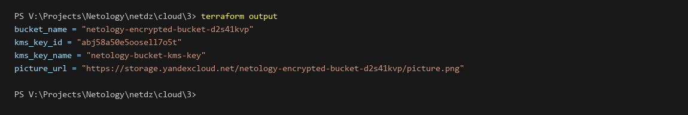
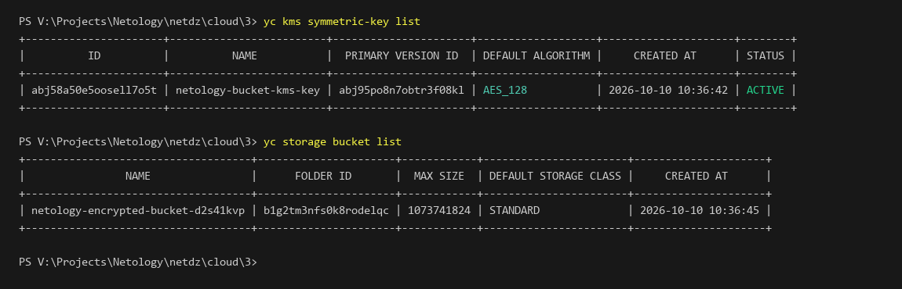
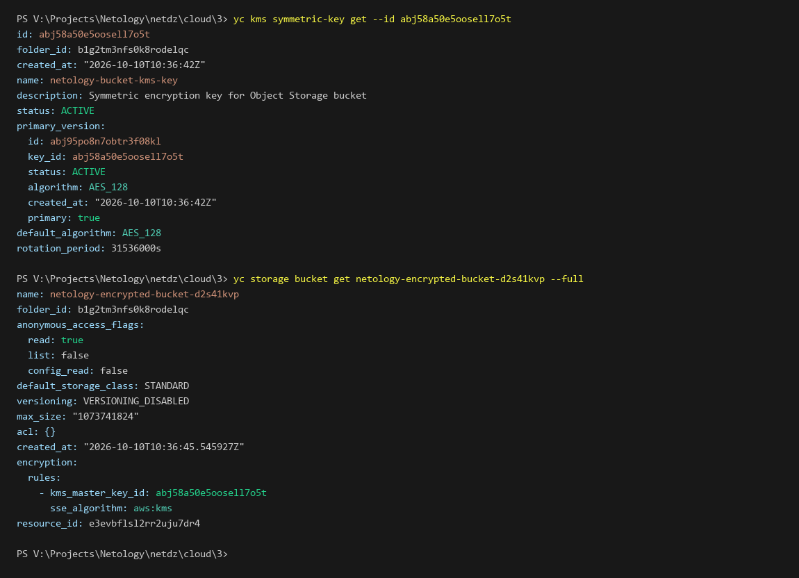
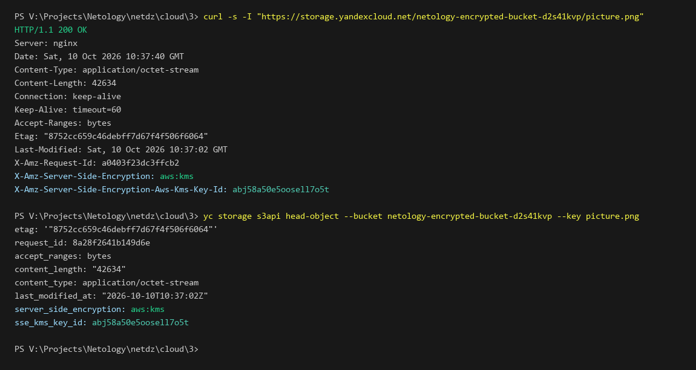

# Задание 1. Yandex Cloud (Шифрование Object Storage с помощью ключа KMS)

## Описание задания

В рамках выполнения домашнего задания реализована конфигурация безопасности и шифрования данных в **Yandex Cloud** с использованием **Terraform** и сервиса управления ключами **KMS (Key Management Service)**:

1. **Симметричный ключ шифрования KMS (`yandex_kms_symmetric_key`)**:

   - Создан симметричный ключ `netology-bucket-kms-key` с алгоритмом шифрования по умолчанию `AES_128`.
   - Настроен период автоматической ротации ключа `8760h` (1 год).
   - Сервисному аккаунту назначена роль `kms.keys.encrypterDecrypter` через привязку `yandex_kms_symmetric_key_iam_binding` для прозрачного шифрования и расшифрования объектов.
2. **Шифрование бакета Object Storage (`yandex_storage_bucket`)**:

   - Создан бакет `netology-encrypted-bucket-d2s41kvp` со случайным уникальным суффиксом.
   - Включено шифрование на стороне сервера (Server-Side Encryption) с помощью блока `server_side_encryption_configuration`:
     - Алгоритм шифрования: `aws:kms`.
     - Мастер-ключ: идентификатор созданного KMS ключа.
   - Настроена опция `force_destroy = true` для гарантированного и чистого удаления бакета вместе с объектами при выполнении `terraform destroy`.
3. **Загрузка и защита объектов в бакете**:

   - В зашифрованный бакет загружен графический файл `picture.png`.
   - Выполнена проверка заголовков ответа S3 API: сервер подтверждает аппаратное шифрование объектов ключом KMS (`X-Amz-Server-Side-Encryption: aws:kms` и `X-Amz-Server-Side-Encryption-Aws-Kms-Key-Id`).

---

## Результат выполнения terraform apply и terraform output

Вывод команды `terraform output` в консоли:



```text
bucket_name = "netology-encrypted-bucket-d2s41kvp"
kms_key_id = "abj58a50e5oosell7o5t"
kms_key_name = "netology-bucket-kms-key"
picture_url = "https://storage.yandexcloud.net/netology-encrypted-bucket-d2s41kvp/picture.png"
```

---

## Верификация ресурсов в Yandex Cloud через CLI

Проверка созданного симметричного ключа KMS и бакета Object Storage через консольные утилиты `yc`:



```text
yc kms symmetric-key list
+----------------------+-------------------------+----------------------+-------------------+---------------------+--------+
|          ID          |          NAME           |  PRIMARY VERSION ID  | DEFAULT ALGORITHM |     CREATED AT      | STATUS |
+----------------------+-------------------------+----------------------+-------------------+---------------------+--------+
| abj58a50e5oosell7o5t | netology-bucket-kms-key | abj95po8n7obtr3f08kl | AES_128           | 2026-10-10 10:36:42 | ACTIVE |
+----------------------+-------------------------+----------------------+-------------------+---------------------+--------+

yc storage bucket list
+------------------------------------+----------------------+------------+-----------------------+---------------------+
|                NAME                |      FOLDER ID       |  MAX SIZE  | DEFAULT STORAGE CLASS |     CREATED AT      |
+------------------------------------+----------------------+------------+-----------------------+---------------------+
| netology-encrypted-bucket-d2s41kvp | b1g2tm3nfs0k8rodelqc | 1073741824 | STANDARD              | 2026-10-10 10:36:45 |
+------------------------------------+----------------------+------------+-----------------------+---------------------+
```

---

## Тестирование и верификация через консоль

### 1. Проверка конфигурации ключа KMS и параметров шифрования бакета

Детальный просмотр параметров ключа KMS (`yc kms symmetric-key get`) и полной конфигурации бакета (`yc storage bucket get --full`):



```text
yc kms symmetric-key get --id abj58a50e5oosell7o5t
id: abj58a50e5oosell7o5t
folder_id: b1g2tm3nfs0k8rodelqc
created_at: "2026-10-10T10:36:42Z"
name: netology-bucket-kms-key
description: Symmetric encryption key for Object Storage bucket
status: ACTIVE
primary_version:
  id: abj95po8n7obtr3f08kl
  key_id: abj58a50e5oosell7o5t
  status: ACTIVE
  algorithm: AES_128
  created_at: "2026-10-10T10:36:42Z"
  primary: true
default_algorithm: AES_128
rotation_period: 31536000s

yc storage bucket get netology-encrypted-bucket-d2s41kvp --full
name: netology-encrypted-bucket-d2s41kvp
folder_id: b1g2tm3nfs0k8rodelqc
anonymous_access_flags:
  read: true
  list: false
  config_read: false
default_storage_class: STANDARD
versioning: VERSIONING_DISABLED
max_size: "1073741824"
acl: {}
created_at: "2026-10-10T10:36:45.545927Z"
encryption:
  rules:
    - kms_master_key_id: abj58a50e5oosell7o5t
      sse_algorithm: aws:kms
resource_id: e3evbflsl2rr2uju7dr4
```

В секции `encryption.rules` зафиксировано:

- `kms_master_key_id: abj58a50e5oosell7o5t` (соответствует созданному ключу KMS).
- `sse_algorithm: aws:kms` (шифрование на стороне сервера при размещении объектов).

---

### 2. Проверка шифрования объектов на стороне сервера (Server-Side Encryption, SSE-KMS)

Проверка HTTP-заголовков объекта через прямой запрос `curl -s -I` и метаданных объекта через `yc storage s3api head-object`:



```text
curl -s -I "https://storage.yandexcloud.net/netology-encrypted-bucket-d2s41kvp/picture.png"
HTTP/1.1 200 OK
Server: nginx
Date: Sat, 10 Oct 2026 10:37:40 GMT
Content-Type: application/octet-stream
Content-Length: 42634
Connection: keep-alive
Keep-Alive: timeout=60
Accept-Ranges: bytes
Etag: "8752cc659c46debff7d67f4f506f6064"
Last-Modified: Sat, 10 Oct 2026 10:37:02 GMT
X-Amz-Request-Id: a0403f23dc3ffcb2
X-Amz-Server-Side-Encryption: aws:kms
X-Amz-Server-Side-Encryption-Aws-Kms-Key-Id: abj58a50e5oosell7o5t

yc storage s3api head-object --bucket netology-encrypted-bucket-d2s41kvp --key picture.png
etag: '"8752cc659c46debff7d67f4f506f6064"'
request_id: 8a28f2641b149d6e
accept_ranges: bytes
content_length: "42634"
content_type: application/octet-stream
last_modified_at: "2026-10-10T10:37:02Z"
server_side_encryption: aws:kms
sse_kms_key_id: abj58a50e5oosell7o5t
```

Заголовки `X-Amz-Server-Side-Encryption: aws:kms` и `X-Amz-Server-Side-Encryption-Aws-Kms-Key-Id: abj58a50e5oosell7o5t` подтверждают, что контент зашифрован ключом KMS при сохранении в хранилище.
