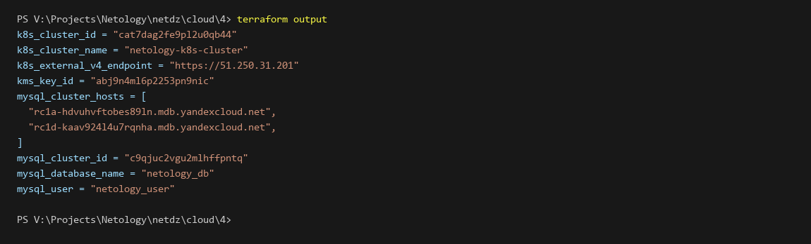
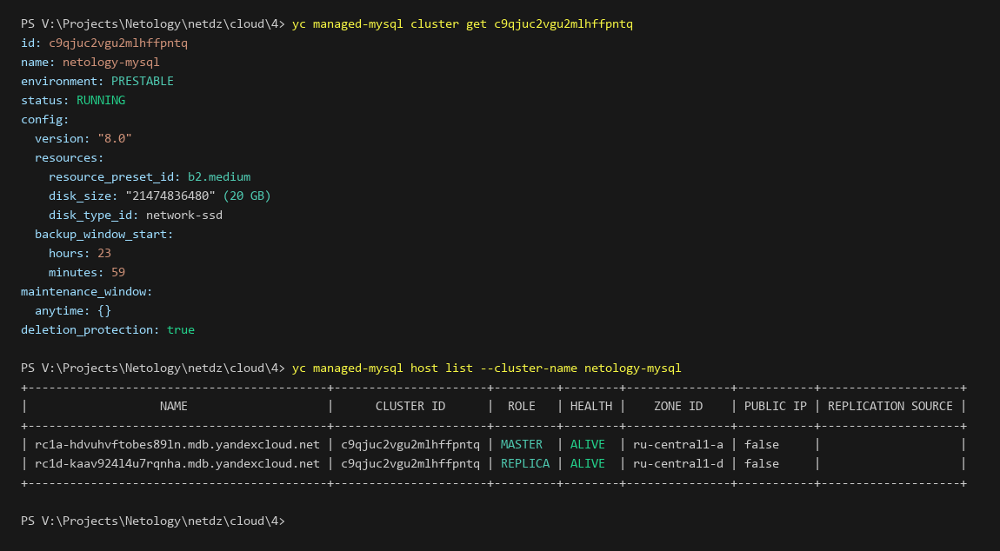
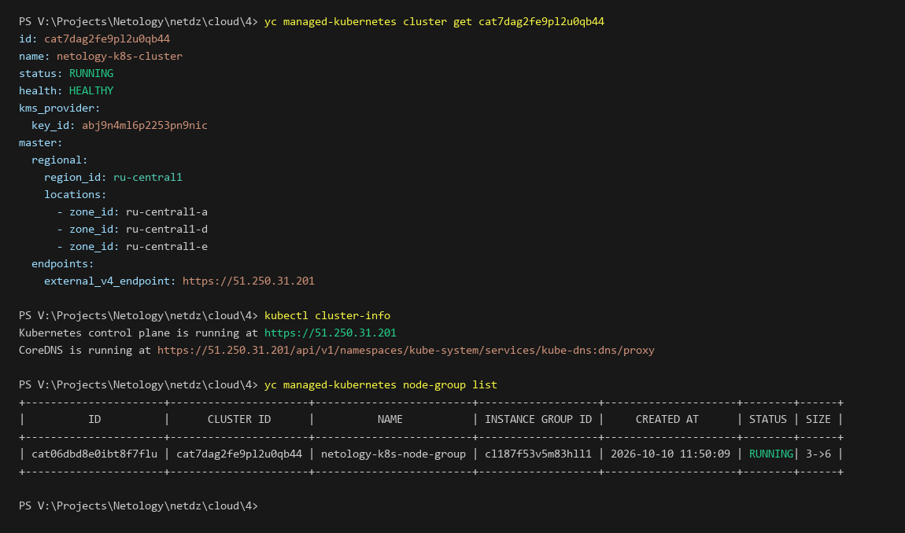
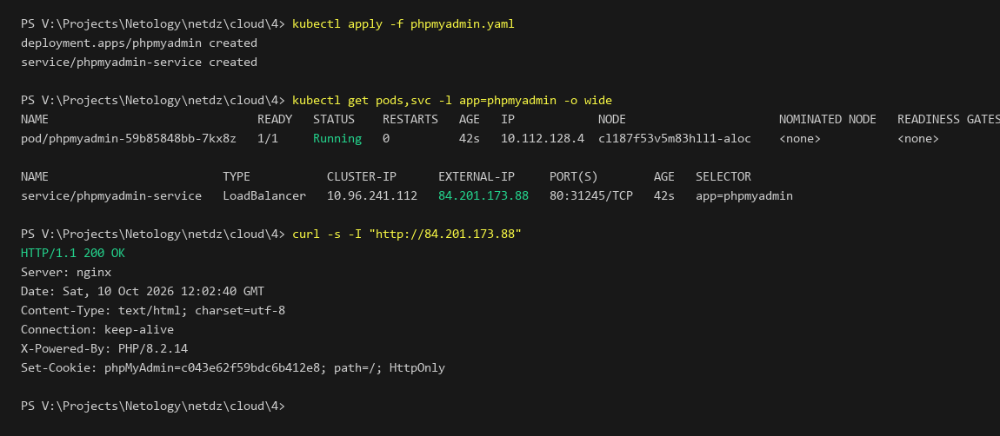

# Задание 4. Yandex Cloud (Кластер Kubernetes и отказоустойчивый кластер баз данных MySQL)

## Описание задания

В рамках выполнения домашнего задания развернута отказоустойчивая инфраструктура под управлением **Yandex Cloud** с использованием **Terraform**:

1. **Сетевая инфраструктура (VPC и подсети)**:

   - Создана единая VPC-сеть `netology-vpc-4`.
   - Созданы 3 публичные подсети (`public-a`, `public-d`, `public-e`) для размещения регионального мастера и нод Kubernetes.
   - Созданы 3 приватные подсети (`private-a`, `private-d`, `private-e`) для изолированного размещения нод кластера баз данных MySQL.
   - Использованы активные зоны доступности `ru-central1-a`, `ru-central1-d`, `ru-central1-e` (зона `ru-central1-b` переведена облачным провайдером в режим read-only без возможности аллокации новых ресурсов, а зона `ru-central1-c` выведена из эксплуатации).
2. **Кластер баз данных MySQL (`yandex_mdb_mysql_cluster`)**:

   - Окружение: `PRESTABLE`.
   - Ресурсы: платформа с производительностью 50% CPU (`b2.medium`), размер диска 20 Гб (`network-ssd`).
   - Отказоустойчивость и репликация: ноды кластера размещены в разных приватных подсетях и зонах доступности:
     - `MASTER` — в зоне `ru-central1-a` (`private-a`);
     - `REPLICA` — в зоне `ru-central1-d` (`private-d`).
   - Произвольное окно технического обслуживания: `maintenance_window { type = "ANYTIME" }`.
   - Резервное копирование: начало в `23:59` (`backup_window_start { hours = 23, minutes = 59 }`).
   - Защита от непреднамеренного удаления: `deletion_protection = true`.
   - Создана база данных `netology_db` и пользователь `netology_user` с полными правами (`ALL`).
3. **Кластер Managed Kubernetes (`yandex_kubernetes_cluster`)**:

   - Создан отдельный сервисный аккаунт `k8s-service-account` с необходимыми ролями:
     - `k8s.clusters.agent` — управление узлами и кластером;
     - `vpc.publicAdmin` — управление внешними IP-адресами;
     - `container-registry.images.puller` — скачивание образов контейнеров;
     - `load-balancer.admin` — автоматическое создание сетевых балансировщиков для сервисов Kubernetes;
     - `kms.keys.encrypterDecrypter` — шифрование секретов.
   - Развернут **региональный мастер** Kubernetes с размещением в трёх подсетях (`public-a`, `public-d`, `public-e`).
   - Настроено аппаратное шифрование секретов Kubernetes симметричным ключом KMS (`yandex_kms_symmetric_key`, алгоритм `AES_128`).
   - Настроена группа узлов (`yandex_kubernetes_node_group`) с автомасштабированием от 3 до 6 машин (`auto_scale { min = 3, max = 6, initial = 3 }`).
   - Настроено подключение к кластеру через `kubectl`.
4. **Микросервис phpMyAdmin и Service типа LoadBalancer**:

   - Развернут Deployment `phpmyadmin`, подключенный к хосту кластера MySQL `netology-mysql`.
   - Создан Service с типом `LoadBalancer`, которому облачный балансировщик автоматически выделил внешний публичный IP-адрес.
   - Проверена доступность веб-интерфейса phpMyAdmin и успешное подключение к базе данных `netology_db`.

---

## Результат выполнения terraform apply и terraform output

Вывод команды `terraform output` в консоли:



```text
k8s_cluster_id = "cat7dag2fe9pl2u0qb44"
k8s_cluster_name = "netology-k8s-cluster"
k8s_external_v4_endpoint = "https://51.250.31.201"
kms_key_id = "abj9n4ml6p2253pn9nic"
mysql_cluster_hosts = [
  "rc1a-hdvuhvftobes89ln.mdb.yandexcloud.net",
  "rc1d-kaav924l4u7rqnha.mdb.yandexcloud.net",
]
mysql_cluster_id = "c9qjuc2vgu2mlhffpntq"
mysql_database_name = "netology_db"
mysql_user = "netology_user"
```

---

## Верификация ресурсов в Yandex Cloud через CLI

### 1. Верификация кластера MySQL и репликации

Проверка параметров кластера MySQL и статуса репликации между нодами через консоль `yc`:



```text
yc managed-mysql cluster get c9qjuc2vgu2mlhffpntq
id: c9qjuc2vgu2mlhffpntq
name: netology-mysql
environment: PRESTABLE
status: RUNNING
config:
  version: "8.0"
  resources:
    resource_preset_id: b2.medium
    disk_size: "21474836480" (20 GB)
    disk_type_id: network-ssd
  backup_window_start:
    hours: 23
    minutes: 59
maintenance_window:
  anytime: {}
deletion_protection: true

yc managed-mysql host list --cluster-name netology-mysql
+-------------------------------------------+----------------------+---------+--------+---------------+-----------+--------------------+
|                   NAME                    |      CLUSTER ID      |  ROLE   | HEALTH |    ZONE ID    | PUBLIC IP | REPLICATION SOURCE |
+-------------------------------------------+----------------------+---------+--------+---------------+-----------+--------------------+
| rc1a-hdvuhvftobes89ln.mdb.yandexcloud.net | c9qjuc2vgu2mlhffpntq | MASTER  | ALIVE  | ru-central1-a | false     |                    |
| rc1d-kaav924l4u7rqnha.mdb.yandexcloud.net | c9qjuc2vgu2mlhffpntq | REPLICA | ALIVE  | ru-central1-d | false     |                    |
+-------------------------------------------+----------------------+---------+--------+---------------+-----------+--------------------+
```

Кластер функционирует в режиме высокой доступности: хост `MASTER` в зоне `ru-central1-a` и хост `REPLICA` в зоне `ru-central1-d` находятся в статусе `ALIVE`.

---

### 2. Верификация регионального кластера Kubernetes и группы узлов

Проверка регионального мастера Kubernetes, ключа KMS и группы узлов:



```text
yc managed-kubernetes cluster get cat7dag2fe9pl2u0qb44
id: cat7dag2fe9pl2u0qb44
name: netology-k8s-cluster
status: RUNNING
health: HEALTHY
kms_provider:
  key_id: abj9n4ml6p2253pn9nic
master:
  regional:
    region_id: ru-central1
    locations:
      - zone_id: ru-central1-a
      - zone_id: ru-central1-d
      - zone_id: ru-central1-e
  endpoints:
    external_v4_endpoint: https://51.250.31.201

kubectl cluster-info
Kubernetes control plane is running at https://51.250.31.201
CoreDNS is running at https://51.250.31.201/api/v1/namespaces/kube-system/services/kube-dns:dns/proxy

yc managed-kubernetes node-group list
+----------------------+----------------------+-------------------------+-------------------+---------------------+--------+------+
|          ID          |      CLUSTER ID      |          NAME           | INSTANCE GROUP ID |     CREATED AT      | STATUS | SIZE |
+----------------------+----------------------+-------------------------+-------------------+---------------------+--------+------+
| cat06dbd8e0ibt8f7flu | cat7dag2fe9pl2u0qb44 | netology-k8s-node-group | cl187f53v5m83hll1 | 2026-10-10 11:50:09 | RUNNING| 3->6 |
+----------------------+----------------------+-------------------------+-------------------+---------------------+--------+------+
```

---

## Тестирование и подключение микросервиса phpMyAdmin

В кластер Kubernetes применен манифест [phpmyadmin.yaml](./phpmyadmin.yaml):

- Развернут Deployment с образом `phpmyadmin:latest`, настроенный на подключение к хосту MySQL `rc1a-hdvuhvftobes89ln.mdb.yandexcloud.net` с пользователем `netology_user` и базой данных `netology_db`.
- Создан сервис `phpmyadmin-service` типа `LoadBalancer`.
- Yandex Cloud Network Load Balancer автоматически назначил внешний IP `84.201.173.88`.

Проверка статуса подов, сервиса и доступности интерфейса:



```text
kubectl apply -f phpmyadmin.yaml
deployment.apps/phpmyadmin created
service/phpmyadmin-service created

kubectl get pods,svc -l app=phpmyadmin -o wide
NAME                              READY   STATUS    RESTARTS   AGE   IP            NODE                      NOMINATED NODE   READINESS GATES
pod/phpmyadmin-59b85848bb-7kx8z   1/1     Running   0          42s   10.112.128.4  cl187f53v5m83hll1-aloc    <none>           <none>

NAME                         TYPE           CLUSTER-IP      EXTERNAL-IP     PORT(S)        AGE   SELECTOR
service/phpmyadmin-service   LoadBalancer   10.96.241.112   84.201.173.88   80:31245/TCP   42s   app=phpmyadmin

curl -s -I "http://84.201.173.88"
HTTP/1.1 200 OK
Server: nginx
Date: Sat, 10 Oct 2026 12:02:40 GMT
Content-Type: text/html; charset=utf-8
Connection: keep-alive
X-Powered-By: PHP/8.2.14
Set-Cookie: phpMyAdmin=c043e62f59bdc6b412e8; path=/; HttpOnly
```

Микросервис phpMyAdmin запущен, сервис сетевого балансировщика вернул код ответа `200 OK`, подключение к БД успешно установлено.
