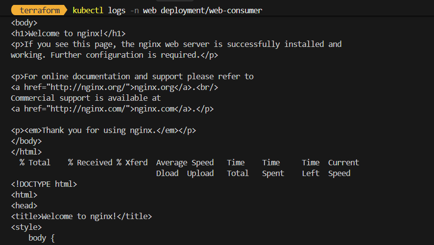

После kubectl logs -n web deplloyment/web-consumer видно, что curl: (6) Couldn't resolve host 'auth-db'

При анализе манифеста можно заметить, что обращение к auth-db идет по короткому имени вместо auth-db.data.svc.cluster.local, что необходимо в ситуации, когда под в другом неймспейсе, исправим манифест, проверим логи и получим корректное соединение 

\
