Задание 1
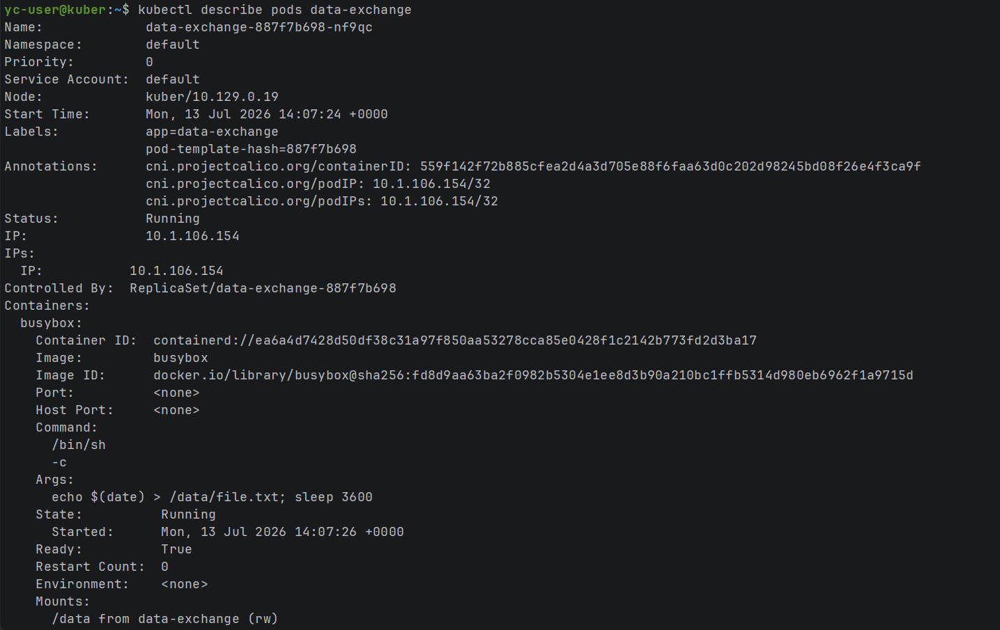
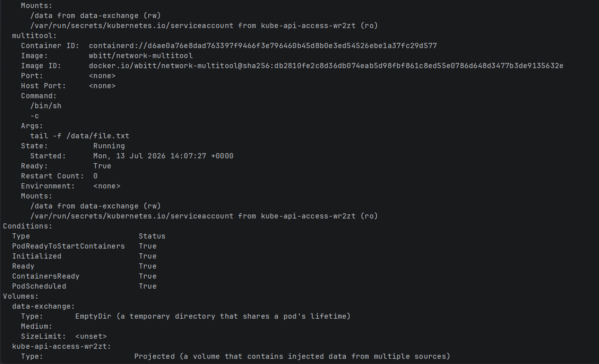
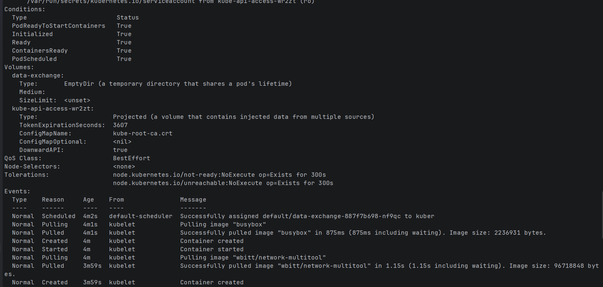
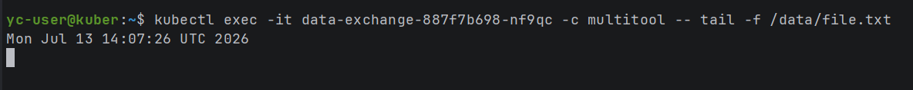

Задание 2
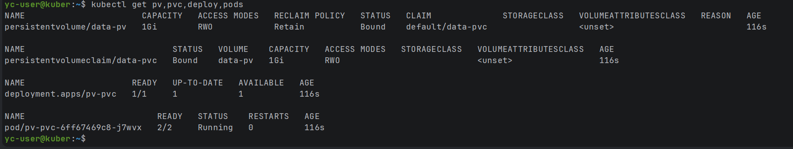
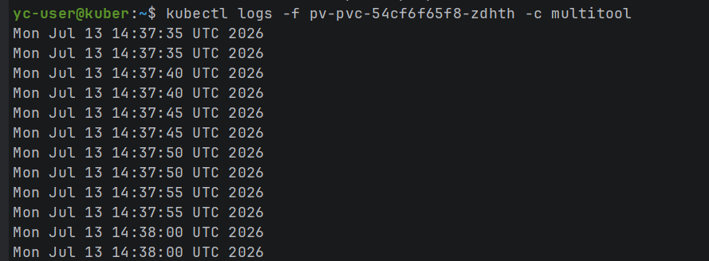
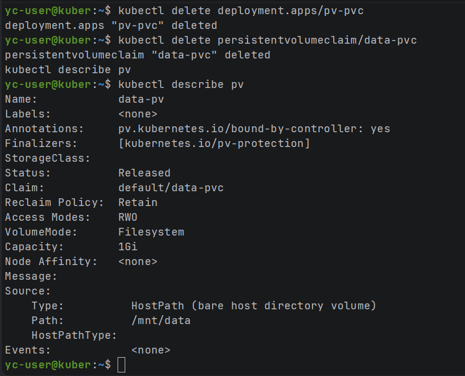

Из-за persistentVolumeReclaimPolicy: Retain, PV перешел в статус Released, а не удалился (удаление требует ручного взаимодействия)
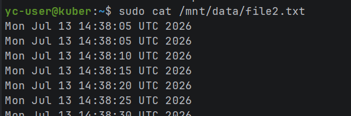
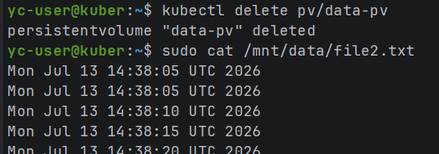

c файлом ничего не произошло, мы просто удалили объект кубера(pv), а он просто описывает ресурс хранения

Задание 3
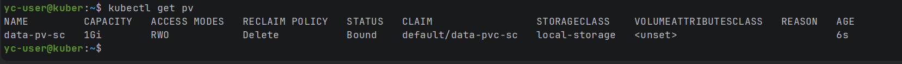
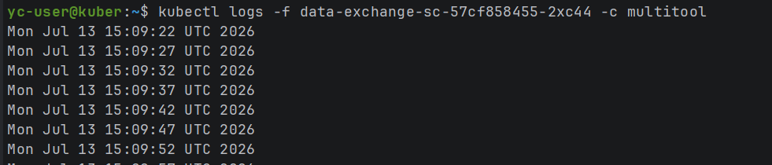