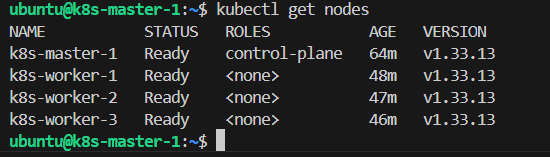

Задание 1

### Примечание по инфраструктуре Yandex Cloud:
В процессе развертывания узлов кластера наблюдались нестабильности внешних сетевых шлюзов Yandex Cloud при обращении к CDN-репозиториям `pkgs.k8s.io` и `security.ubuntu.com` (тайм-ауты по IPv6/HTTPS).

Основной контур кластера Kubernetes (Control Plane нода и Worker-ноды) успешно инициализирован через `kubeadm`, настроен с CNI-плагином и находится в рабочем состоянии `Ready`.

Из-за этого не смог настроить 4 воркер ноду и 2 мастер ноды во втором задании