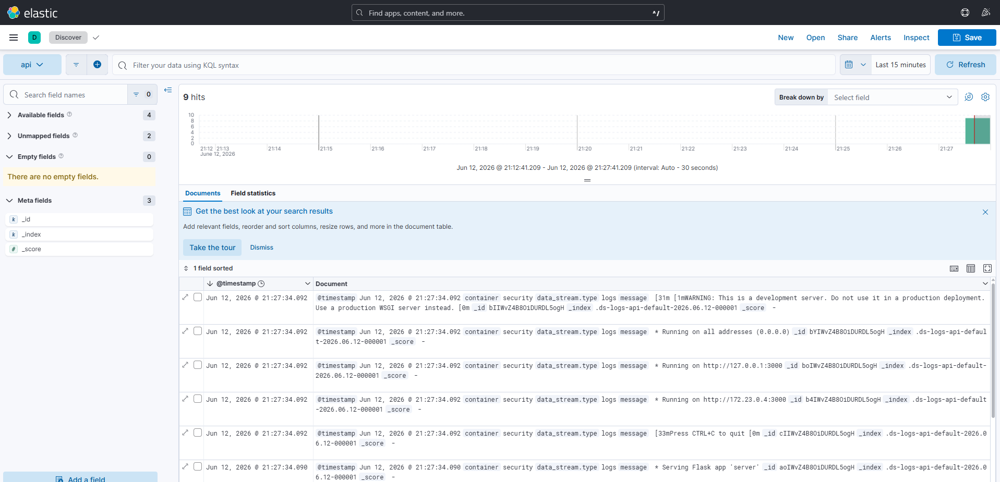

Задание 1

|Инструмент|Облачная система|СКВ Git|Репо на каждый сервис|Запуск по событию из СКВ|Запуск по кнопке (с параметрами)|Настройки к каждой сборке|Шаблоны для конфигураций|Безопасное хранение секретов|Несколько конфигов из 1 репо|Кастомные шаги при сборке|Свои Docker-образы|Агенты на своих серверах|Параллельные сборки|Параллельные тесты|
|:--|:-:|:-:|:-:|:-:|:-:|:-:|:-:|:-:|:-:|:-:|:-:|:-:|:-:|:-:|
|**GitHub Actions**|✓|✓|✓|✓|✓|✓|✓|✓|✓|✓|✓|✓|✓|✓|
|**GitLab CI/CD**|✓|✓|✓|✓|✓|✓|✓|✓|✓|✓|✓|✓|✓|✓|
|**Jenkins**|✗|✓|✓|✓|✓|✓|✓|✓|✓|✓|✓|✓|✓|✓|
|**TeamCity**|✓|✓|✓|✓|✓|✓|✓|✓|✓|✓|✓|✓|✓|✓|
|**CircleCI**|✓|✓|✓|✓|✓|✓|✓|✓|✓|✓|✓|✓|✓|✓|
|**DeployHQ**|✓|✓|✓|✓|✓|✓|✓|✓|✓|✓|✓|✗|✗|✗|
|**Buildkite**|✓|✓|✓|✓|✓|✓|✓|✓|✓|✓|✓|✓|✓|✓|
|**GoCD**|✗|✓|✓|✓|✓|✓|✓|✓|✓|✓|✓|✓|✓|✓|
|**Harness**|✓|✓|✓|✓|✓|✓|✓|✓|✓|✓|✓|✓|✓|✓|
|**Azure DevOps**|✓|✓|✓|✓|✓|✓|✓|✓|✓|✓|✓|✓|✓|✓|
|**Dagger**|✓|✓|✓|✓|✓|✓|✓|✓|✓|✓|✓|✓|✓|✓|
|**Octopus Deploy**|✓|✓|✓|✓|✓|✓|✓|✓|✓|✓|✓|✓|✓|✗|
|**GitFlic**|✓|✓|✓|✓|✓|✓|✓|✓|✓|✓|✓|✓|✓|✓|
|**GitVerse**|✓|✓|✓|✓|✓|✓|✓|✓|✓|✓|✓|✓|✓|✓|

Мой выбор GitLab CI/CD

Использование единой платформы избавляет от необходимости интегрировать отдельные продукты (например, отдельный Git-сервер и отдельный CI-сервер вроде Jenkins), предотвращая зоопарк инструментов
**облачная система**: GitLab предоставляется как в виде управляемого облачного SaaS-решения, так и в виде коробочной версии (Self-managed) для установки на ваших ресурсах.

**система контроля версий Git**: Платформа изначально построена вокруг мощного Git-сервера и предоставляет все необходимые инструменты для безопасного версионирования исходного кода и управления им.

**репозиторий на каждый сервис**: В GitLab вы можете создавать изолированные проекты (репозитории) для каждого микросервиса и гибко структурировать их, объединяя в группы и подгруппы в соответствии с организационной иерархией.

**запуск сборки по событию из системы контроля версий**: Конвейеры (пайплайны) CI/CD запускаются автоматически в ответ на различные события в репозитории: фиксация изменений (коммит в ветку), создание запроса на слияние (merge request) или установка релизного тега.

**запуск сборки по кнопке с указанием параметров**: Инструменты CI/CD позволяют запускать пайплайны и отдельные задачи вручную, а также передавать и настраивать специфические переменные окружения во время выполнения сборки или деплоя.

**возможность привязать настройки к каждой сборке**: Настройка всего процесса следует подходу «конфигурация как код». В корне каждого репозитория создается конфигурационный файл `.gitlab-ci.yml`, который жестко привязывает логику пайплайна (сборка, тесты, деплой) к конкретному проекту.

**возможность создания шаблонов для различных конфигураций сборок**: GitLab предлагает *CI/CD catalog* — встроенную библиотеку с заранее настроенными переиспользуемыми компонентами пайплайнов. В рамках вашей организации вы также можете создать централизованный проект с базовыми шаблонами (например, `jvm.yml` или `lerna.yml`) и легко подключать их в другие репозитории с помощью директивы `include`.

**возможность безопасного хранения секретных данных (пароли, ключи доступа)**: Платформа обеспечивает ролевое управление доступом (RBAC), интеграцию с системами SSO/SAML и безопасное управление переменными окружения CI/CD, позволяя маскировать пароли, ключи учетных записей и токены без хранения их в открытом виде внутри кода.

**несколько конфигураций для сборки из одного репозитория**: В GitLab реализован механизм родительских и дочерних конвейеров (*parent-child pipelines*). Это позволяет разбивать сложные или объемные рабочие процессы в рамках одного репозитория (в том числе монорепозитория) на независимые, отдельно срабатывающие конвейеры.

**кастомные шаги при сборке**: Инфраструктура конфигурирования через YAML-файл дает абсолютную гибкость — вы можете определять любые типы задач (например, линтеры, статический анализ SAST/DAST, сборка артефактов) и задавать любую последовательность пользовательских скриптов и команд для выполнения.

**собственные докер-образы для сборки проектов**: GitLab включает в себя встроенный реестр контейнеров (*Container Registry*) и позволяет использовать кастомные Docker-образы со строго разрешенным набором пакетов («белые списки») для обеспечения чистой и безопасной изолированной среды при сборке приложения.

**возможность развернуть агентов сборки на собственных серверах**: Всю физическую работу по сборке в GitLab выполняют агенты (GitLab Runner). Система оркестрации позволяет подключать ваших собственных локальных (self-managed) агентов для сборки кода на внутренних серверах инфраструктуры, что отвечает строгим корпоративным правилам.

**возможность параллельного запуска нескольких сборок**: Облачная архитектура пайплайнов и использование собственных раннеров с функцией автомасштабирования (autoscaling runners) позволяют GitLab выполнять множество независимых задач параллельно (Parallel jobs).

**возможность параллельного запуска тестов**: Функция *Parallel jobs* в GitLab CI позволяет эффективно распараллеливать этапы тестирования, что существенно сокращает время выполнения автоматизированных тестов и ускоряет обратную связь для разработчиков.

Задание 2

Для обеспечения сбора и анализа логов в микросервисной архитектуре предлагается использовать один из двух современных стандартов де-факто: стек PLG (Promtail, Loki, Grafana) или стек EFK/ELK (Elasticsearch, Fluentd/Filebeat/LogStash, Kibana)

Мой выбор - PLG (экономия ресурсов, бесшовная интеграция с мониторингом)

**1. Сбор логов в центральное хранилище со всех хостов**
Сборщик Promtail разворачивается на серверах по паттерну **DaemonSet** — то есть по одному агенту на каждый хост (ноду) кластера. Агент автоматически обнаруживает все работающие на хосте контейнеры, собирает их логи и централизованно отправляет в Loki.

**2. Минимальные требования к приложениям (сбор логов из stdout)**
Вам не придется менять код самих микросервисов для внедрения сложных библиотек передачи логов. Приложения могут просто писать логи в стандартный вывод (`stdout` и `stderr`). Среда выполнения контейнеров (например, Docker или ContainerD) автоматически перехватывает этот вывод и сохраняет его в файлы на хосте (чаще всего в директорию `/var/log/containers/`). Сборщик (Promtail) читает эти файлы напрямую с хоста.
*Рекомендация:* Для максимальной эффективности приложениям достаточно выводить логи в `stdout` в формате **структурированного JSON**, чтобы система могла легко парсить отдельные поля.

**3. Гарантированная доставка логов**
Гарантия доставки обеспечивается архитектурой агентов и хранилища. Агенты сбора читают файлы логов и ведут учет своей позиции (checkpoint/offset). Если центральное хранилище (Loki) временно недоступно, агент не потеряет данные, а просто продолжит чтение и отправку с сохраненной позиции после восстановления связи. На стороне Loki компонент *Ingester* (приемник) надежно буферизует входящие потоки в блоки перед их записью в базу данных, что защищает от потерь при пиковых нагрузках.

**4. Обеспечение поиска и фильтрации по записям логов**
Для поиска используется интерфейс Grafana и язык запросов **LogQL**. Вы сможете мгновенно фильтровать логи по меткам (например, `app=payment-service`, `env=prod`), а внутри выбранного потока осуществлять поиск по ключевым словам или регулярным выражениям.

**5. Пользовательский интерфейс и доступ разработчикам**
Grafana предоставляет удобный визуальный интерфейс (вкладка Explore для расследований и Dashboards для графиков). Система имеет встроенное управление правами доступа (RBAC), что позволяет безопасно предоставлять доступ разработчикам. Вы можете настроить права так, чтобы разные команды видели только свои логи, и установить ограничения на слишком "тяжелые" запросы.

**6. Возможность дать ссылку на сохранённый поиск**
Grafana позволяет формировать URL-ссылки, которые содержат сам поисковый запрос (текст фильтра), выбранные метки и точный диапазон времени. При возникновении ошибки разработчик может скопировать ссылку из адресной строки и отправить коллеге — тот откроет её и увидит ровно те же самые логи.

Задание 3

Оптимально использовать стек технологий на базе Prometheus (или VictoriaMetrics), Node Exporter, библиотек инструментирования (таких как OpenTelemetry или клиентские библиотеки Prometheus) и Grafana.

**1. Сбор метрик состояния ресурсов со всех хостов (CPU, RAM, HDD, Network)**
Для сбора низкоуровневых системных метрик серверов используется **Node Exporter**. Этот агент устанавливается на каждом физическом или виртуальном хосте, обслуживающем систему. Он собирает детальную информацию о загрузке процессора, использовании памяти, дисковом пространстве и сетевых интерфейсах, а затем отдает эти данные в формате, понятном системе мониторинга.

**2. Сбор метрик потребляемых ресурсов для каждого сервиса**
В распределенной микросервисной или контейнеризированной инфраструктуре (например, Kubernetes) метрики потребляемых сервисами ресурсов (ЦП, память) собираются встроенными или специализированными экспортерами, такими как **kube-state-metrics**. Они позволяют понимать, сколько системных ресурсов задействует каждый отдельный экземпляр микросервиса.

**3. Сбор метрик, специфичных для каждого сервиса**
Разработчики микросервисов могут внедрять сбор бизнес-метрик и метрик производительности (задержки, количество запросов, ошибки) непосредственно в код. Это делается с помощью **клиентских библиотек Prometheus** или фреймворков вроде **Micrometer** и **OpenTelemetry**. После инструментирования код приложения начинает подсчитывать нужные показатели и выставляет их наружу через HTTP-эндпоинт (по умолчанию `/metrics`).

**4. Централизованное хранение и сбор метрик**
Ядром системы, агрегирующим данные, выступает **Prometheus** (time-series база данных временных рядов).
* **Принцип взаимодействия:** Prometheus использует *pull-модель*. Он периодически подключается к эндпоинтам экспортеров (Node Exporter) и самих сервисов, чтобы «забрать» накопленные метрики.
* Для микросервисной среды крайне важна функция **Service Discovery** в Prometheus, которая позволяет ему автоматически находить новые сервисы и контейнеры при их масштабировании без необходимости прописывать каждый IP-адрес вручную.
* **Оптимизация базы данных:** При огромных объемах данных в качестве хранилища можно использовать **VictoriaMetrics**. Она работает как drop-in замена (полностью совместима с Prometheus), но обрабатывает запросы значительно быстрее, потребляя при этом в разы меньше оперативной памяти и места на диске. Кроме того, VictoriaMetrics поддерживает не только pull-модель, но и *push-модель* (когда сервисы сами отправляют данные в базу).

**5. Пользовательский интерфейс для запросов, агрегации и дашбордов**
За визуализацию отвечает веб-интерфейс **Grafana**.
* **Создание запросов:** Grafana подключается к базе Prometheus/VictoriaMetrics. Для того чтобы делать запросы и агрегировать данные, используется мощный язык запросов **PromQL**.
* **Настройка панелей:** С помощью Grafana вы можете создавать кастомные дашборды и графики (time series, gauge, таблицы) для отслеживания «четырех золотых сигналов» (задержки, трафик, ошибки, насыщенность) и других нужных параметров. Существует множество готовых шаблонов (например, "Node Exporter Full").

**Обоснование выбора:**
1. **Де-факто стандарт индустрии:** Связка Prometheus + Grafana является общепринятым стандартом мониторинга (особенно в связке с Kubernetes и микросервисами), обладает огромным комьюнити и лучшей совместимостью из коробки.
2. **Динамичность и масштабируемость:** Благодаря pull-модели и механизмам Service Discovery, инфраструктура мониторинга не зависит от количества микросервисов. Агентам не нужно знать, куда слать данные, а Prometheus автоматически обнаруживает новые поды/хосты.
3. **Разделение ответственности:** Система состоит из легковесных заменяемых компонентов. Агенты (Node Exporter) ничего не знают о базе данных, Prometheus занят только сбором и хранением, а Grafana — только визуализацией.
4. **Гибкость обработки:** Использование языка PromQL позволяет строить математические агрегации метрик на лету, что критически важно для анализа огромного числа микросервисов и серверов одновременно. А замена Prometheus на VictoriaMetrics обеспечит высокую производительность при экономии ресурсов сервера.

Задание 4

Задание 5
