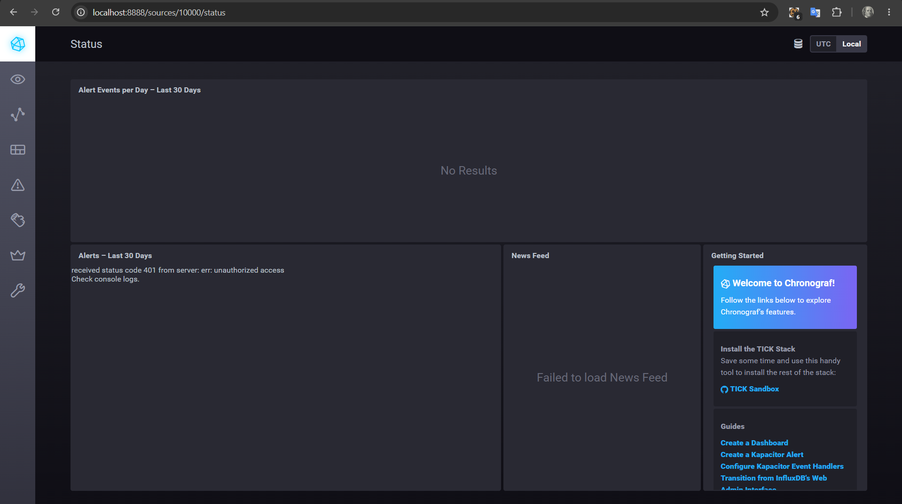
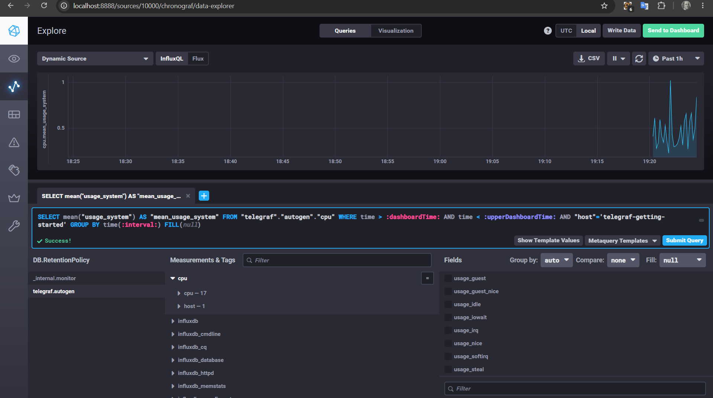
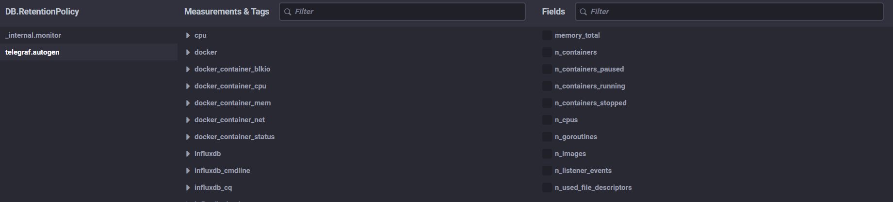
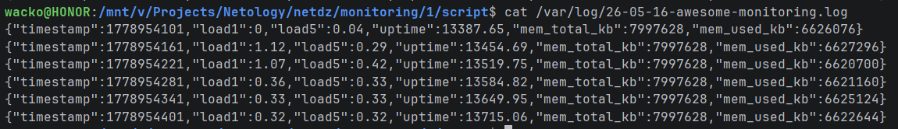
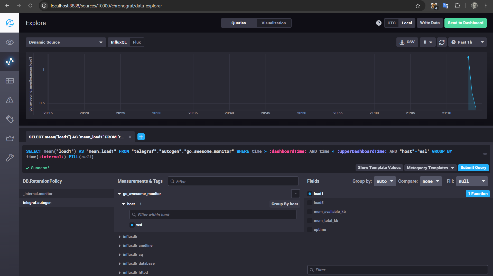

1. Платформа для вычислений, вычисления производит процессор, значит нужны метрики CPU: utilization, load average, context switches, interrupts, steal time.
Отчеты сохраняются на диск поэтому также добавим метрики: utilization, IOPS, latency, saturation, errors.
Так как используется протокол http, к нему подключим метрики: request rate, error rate, latency, payload, success rate.
2. Исходя из состояния RAM/inodes/CPUla создать метрику в порядке ли сервер (где будет либо да, либо нет), для клиентов введем SLA, качество обслуживания - SLI
3. Развернуть open-source или бесплатные self-host решения на имеющихся серверах, допустим Loki + Promtail
4. формула должна быть summ_1xx_requests+summ_2xx_requests+summ_3xx_requests/summ_all_requests или 1 - summ_4xx_requests+summ_5xx_requests/summ_all_requests
5. Плюсы Pull: простой контроль за частотой опроса, легче диагностика мертвых сервисов; минусы: старые системы без http эндпоинтов не отдадут метрики, могут быть проблемы с firewall/nat.
Плюсы Push: работает даже если у центральной системы мониторинга нет доступа к сервису, можно отправлять метрики практически с чего угодно, буферизация метрик, хорошо подходит для динамических сред; минусы: сложнее контроль над частотой обновления метрик, труднее определение мертвых сервисов, потенциальная нагрузка на сеть.
6. Prometheus - pull, с puthgateway - push

   TICK - push

   Zabbix - гибрид

   VictoriaMetrics - гибрид

   Nagios - гибрид
7. 
8. 
9. 

10.1

питон не знаю, знаю гошку, поэтому скрипт на ней
monitoring/1/script/main.go
* * * * * /mnt/v/Projects/Netology/netdz/monitoring/1/script/monitor

10.2

вместо создания дешборда, логи из задания выше шлются в телеграф

