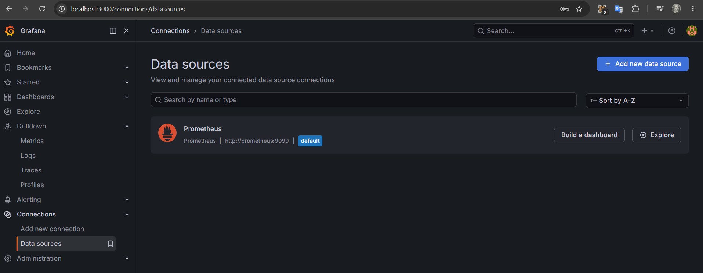
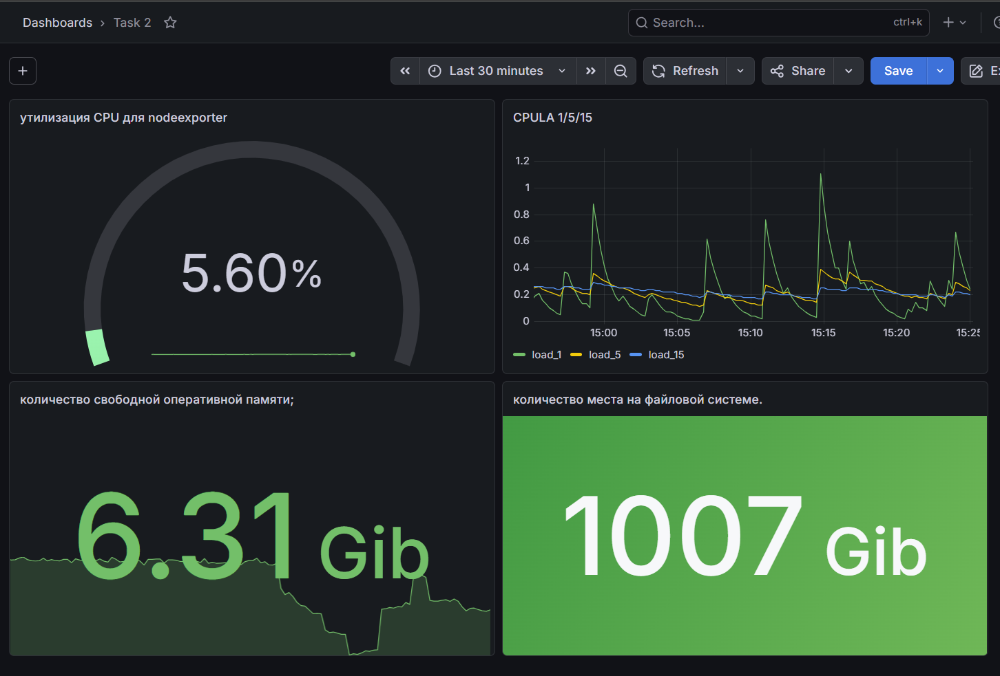
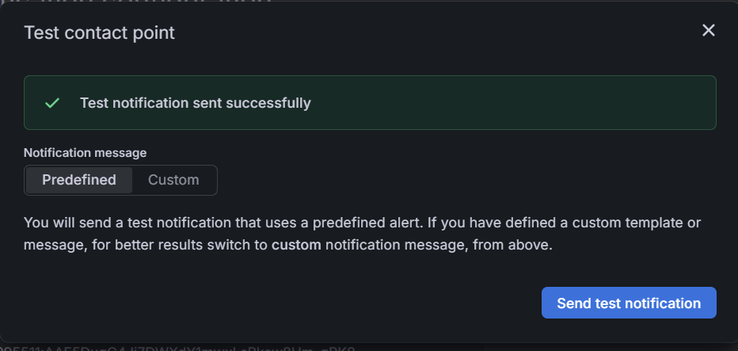
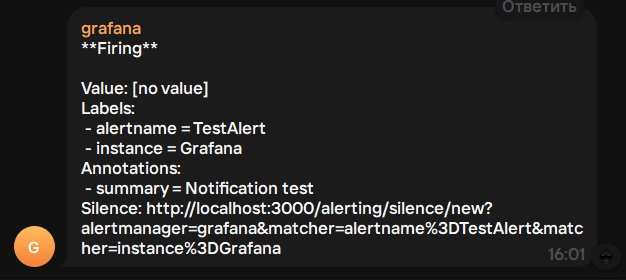

1

2

```
100 - (avg by(instance) (rate(node_cpu_seconds_total{mode="idle"}[5m])) * 100)
```
```
node_load1
node_load5
node_load15
```
```
node_memory_MemAvailable_bytes
```
```
node_filesystem_size_bytes{mountpoint!="/tmp"}
```
3


4
```
{
  "apiVersion": "dashboard.grafana.app/v2",
  "kind": "Dashboard",
  "metadata": {
    "name": "adtw5ws",
    "namespace": "default",
    "uid": "f571aa36-ed14-4eb2-b9dd-d8fd19c3f3d3",
    "resourceVersion": "1779108726770004",
    "generation": 4,
    "creationTimestamp": "2026-05-18T12:15:45Z",
    "labels": {
      "grafana.app/deprecatedInternalID": "2706142500331520"
    },
    "annotations": {
      "grafana.app/createdBy": "user:efmfip33ld2psd",
      "grafana.app/folder": "",
      "grafana.app/saved-from-ui": "Grafana v13.0.1+security-01 (9bbe672d)",
      "grafana.app/updatedBy": "user:efmfip33ld2psd",
      "grafana.app/updatedTimestamp": "2026-05-18T12:52:06Z"
    }
  },
  "spec": {
    "annotations": [
      {
        "kind": "AnnotationQuery",
        "spec": {
          "query": {
            "kind": "DataQuery",
            "group": "grafana",
            "version": "v0",
            "datasource": {
              "name": "-- Grafana --"
            },
            "spec": {}
          },
          "enable": true,
          "hide": true,
          "iconColor": "rgba(0, 211, 255, 1)",
          "name": "Annotations & Alerts",
          "builtIn": true
        }
      }
    ],
    "cursorSync": "Off",
    "editable": true,
    "elements": {
      "panel-1": {
        "kind": "Panel",
        "spec": {
          "id": 1,
          "title": "утилизация CPU для nodeexporter",
          "description": "",
          "links": [],
          "data": {
            "kind": "QueryGroup",
            "spec": {
              "queries": [
                {
                  "kind": "PanelQuery",
                  "spec": {
                    "query": {
                      "kind": "DataQuery",
                      "group": "prometheus",
                      "version": "v0",
                      "datasource": {
                        "name": "bfmfiubc6ed4wa"
                      },
                      "spec": {
                        "editorMode": "code",
                        "expr": "100 - (avg by(instance) (rate(node_cpu_seconds_total{mode=\"idle\"}[5m])) * 100)",
                        "legendFormat": "__auto",
                        "range": true
                      }
                    },
                    "refId": "A",
                    "hidden": false
                  }
                }
              ],
              "transformations": [],
              "queryOptions": {}
            }
          },
          "vizConfig": {
            "kind": "VizConfig",
            "group": "gauge",
            "version": "13.0.1+security-01",
            "spec": {
              "options": {
                "barShape": "flat",
                "barWidthFactor": 0.3,
                "effects": {
                  "barGlow": false,
                  "centerGlow": false,
                  "gradient": true
                },
                "endpointMarker": "point",
                "minVizHeight": 75,
                "minVizWidth": 75,
                "orientation": "auto",
                "reduceOptions": {
                  "calcs": [
                    "lastNotNull"
                  ],
                  "fields": "",
                  "values": false
                },
                "segmentCount": 1,
                "segmentSpacing": 0.3,
                "shape": "gauge",
                "showThresholdLabels": false,
                "showThresholdMarkers": false,
                "sizing": "auto",
                "sparkline": true,
                "textMode": "auto"
              },
              "fieldConfig": {
                "defaults": {
                  "unit": "percent",
                  "min": 0,
                  "max": 100,
                  "thresholds": {
                    "mode": "percentage",
                    "steps": [
                      {
                        "value": 0,
                        "color": "green"
                      },
                      {
                        "value": 80,
                        "color": "red"
                      }
                    ]
                  },
                  "color": {
                    "mode": "palette-classic"
                  }
                },
                "overrides": []
              }
            }
          }
        }
      },
      "panel-2": {
        "kind": "Panel",
        "spec": {
          "id": 2,
          "title": "CPULA 1/5/15",
          "description": "",
          "links": [],
          "data": {
            "kind": "QueryGroup",
            "spec": {
              "queries": [
                {
                  "kind": "PanelQuery",
                  "spec": {
                    "query": {
                      "kind": "DataQuery",
                      "group": "prometheus",
                      "version": "v0",
                      "datasource": {
                        "name": "bfmfiubc6ed4wa"
                      },
                      "spec": {
                        "editorMode": "code",
                        "expr": "node_load1",
                        "legendFormat": "load_1",
                        "range": true
                      }
                    },
                    "refId": "A",
                    "hidden": false
                  }
                },
                {
                  "kind": "PanelQuery",
                  "spec": {
                    "query": {
                      "kind": "DataQuery",
                      "group": "prometheus",
                      "version": "v0",
                      "datasource": {
                        "name": "bfmfiubc6ed4wa"
                      },
                      "spec": {
                        "editorMode": "builder",
                        "expr": "node_load5",
                        "instant": false,
                        "legendFormat": "load_5",
                        "range": true
                      }
                    },
                    "refId": "B",
                    "hidden": false
                  }
                },
                {
                  "kind": "PanelQuery",
                  "spec": {
                    "query": {
                      "kind": "DataQuery",
                      "group": "prometheus",
                      "version": "v0",
                      "datasource": {
                        "name": "bfmfiubc6ed4wa"
                      },
                      "spec": {
                        "editorMode": "builder",
                        "exemplar": false,
                        "expr": "node_load15",
                        "instant": false,
                        "interval": "",
                        "legendFormat": "load_15",
                        "range": true
                      }
                    },
                    "refId": "C",
                    "hidden": false
                  }
                }
              ],
              "transformations": [],
              "queryOptions": {}
            }
          },
          "vizConfig": {
            "kind": "VizConfig",
            "group": "timeseries",
            "version": "13.0.1+security-01",
            "spec": {
              "options": {
                "annotations": {
                  "clustering": -1,
                  "multiLane": false
                },
                "legend": {
                  "calcs": [],
                  "displayMode": "list",
                  "placement": "bottom",
                  "showLegend": true
                },
                "tooltip": {
                  "hideZeros": false,
                  "mode": "single",
                  "sort": "none"
                }
              },
              "fieldConfig": {
                "defaults": {
                  "thresholds": {
                    "mode": "absolute",
                    "steps": [
                      {
                        "value": 0,
                        "color": "green"
                      },
                      {
                        "value": 80,
                        "color": "red"
                      }
                    ]
                  },
                  "color": {
                    "mode": "palette-classic"
                  },
                  "custom": {
                    "axisBorderShow": false,
                    "axisCenteredZero": false,
                    "axisColorMode": "text",
                    "axisLabel": "",
                    "axisPlacement": "auto",
                    "barAlignment": 0,
                    "barWidthFactor": 0.6,
                    "drawStyle": "line",
                    "fillOpacity": 0,
                    "gradientMode": "none",
                    "hideFrom": {
                      "legend": false,
                      "tooltip": false,
                      "viz": false
                    },
                    "insertNulls": false,
                    "lineInterpolation": "linear",
                    "lineWidth": 1,
                    "pointSize": 5,
                    "scaleDistribution": {
                      "type": "linear"
                    },
                    "showPoints": "auto",
                    "showValues": false,
                    "spanNulls": false,
                    "stacking": {
                      "group": "A",
                      "mode": "none"
                    },
                    "thresholdsStyle": {
                      "mode": "off"
                    }
                  }
                },
                "overrides": []
              }
            }
          }
        }
      },
      "panel-3": {
        "kind": "Panel",
        "spec": {
          "id": 3,
          "title": "количество свободной оперативной памяти;",
          "description": "",
          "links": [],
          "data": {
            "kind": "QueryGroup",
            "spec": {
              "queries": [
                {
                  "kind": "PanelQuery",
                  "spec": {
                    "query": {
                      "kind": "DataQuery",
                      "group": "prometheus",
                      "version": "v0",
                      "datasource": {
                        "name": "bfmfiubc6ed4wa"
                      },
                      "spec": {
                        "editorMode": "code",
                        "expr": "node_memory_MemAvailable_bytes",
                        "legendFormat": "__auto",
                        "range": true
                      }
                    },
                    "refId": "A",
                    "hidden": false
                  }
                }
              ],
              "transformations": [],
              "queryOptions": {}
            }
          },
          "vizConfig": {
            "kind": "VizConfig",
            "group": "stat",
            "version": "13.0.1+security-01",
            "spec": {
              "options": {
                "colorMode": "value",
                "graphMode": "area",
                "justifyMode": "auto",
                "orientation": "auto",
                "percentChangeColorMode": "standard",
                "reduceOptions": {
                  "calcs": [
                    "lastNotNull"
                  ],
                  "fields": "",
                  "values": false
                },
                "showPercentChange": false,
                "textMode": "auto",
                "wideLayout": true
              },
              "fieldConfig": {
                "defaults": {
                  "unit": "bits",
                  "thresholds": {
                    "mode": "absolute",
                    "steps": [
                      {
                        "value": 0,
                        "color": "green"
                      },
                      {
                        "value": 80,
                        "color": "red"
                      }
                    ]
                  },
                  "color": {
                    "mode": "palette-classic"
                  }
                },
                "overrides": []
              }
            }
          }
        }
      },
      "panel-4": {
        "kind": "Panel",
        "spec": {
          "id": 4,
          "title": "количество места на файловой системе.",
          "description": "",
          "links": [],
          "data": {
            "kind": "QueryGroup",
            "spec": {
              "queries": [
                {
                  "kind": "PanelQuery",
                  "spec": {
                    "query": {
                      "kind": "DataQuery",
                      "group": "prometheus",
                      "version": "v0",
                      "datasource": {
                        "name": "bfmfiubc6ed4wa"
                      },
                      "spec": {
                        "editorMode": "code",
                        "expr": "node_filesystem_size_bytes{mountpoint!=\"/tmp\"}",
                        "legendFormat": "__auto",
                        "range": true
                      }
                    },
                    "refId": "A",
                    "hidden": false
                  }
                }
              ],
              "transformations": [],
              "queryOptions": {}
            }
          },
          "vizConfig": {
            "kind": "VizConfig",
            "group": "stat",
            "version": "13.0.1+security-01",
            "spec": {
              "options": {
                "colorMode": "background",
                "graphMode": "none",
                "justifyMode": "auto",
                "orientation": "horizontal",
                "percentChangeColorMode": "standard",
                "reduceOptions": {
                  "calcs": [
                    "lastNotNull"
                  ],
                  "fields": "",
                  "values": false
                },
                "showPercentChange": false,
                "textMode": "auto",
                "wideLayout": true
              },
              "fieldConfig": {
                "defaults": {
                  "unit": "bits",
                  "thresholds": {
                    "mode": "absolute",
                    "steps": [
                      {
                        "value": 0,
                        "color": "green"
                      },
                      {
                        "value": 80,
                        "color": "red"
                      }
                    ]
                  },
                  "color": {
                    "mode": "palette-classic"
                  }
                },
                "overrides": []
              }
            }
          }
        }
      }
    },
    "layout": {
      "kind": "AutoGridLayout",
      "spec": {
        "maxColumnCount": 3,
        "columnWidthMode": "standard",
        "rowHeightMode": "standard",
        "items": [
          {
            "kind": "AutoGridLayoutItem",
            "spec": {
              "element": {
                "kind": "ElementReference",
                "name": "panel-1"
              }
            }
          },
          {
            "kind": "AutoGridLayoutItem",
            "spec": {
              "element": {
                "kind": "ElementReference",
                "name": "panel-2"
              }
            }
          },
          {
            "kind": "AutoGridLayoutItem",
            "spec": {
              "element": {
                "kind": "ElementReference",
                "name": "panel-3"
              }
            }
          },
          {
            "kind": "AutoGridLayoutItem",
            "spec": {
              "element": {
                "kind": "ElementReference",
                "name": "panel-4"
              }
            }
          }
        ]
      }
    },
    "links": [],
    "liveNow": false,
    "preload": false,
    "tags": [],
    "timeSettings": {
      "timezone": "browser",
      "from": "now-6h",
      "to": "now",
      "autoRefresh": "",
      "autoRefreshIntervals": [
        "5s",
        "10s",
        "30s",
        "1m",
        "5m",
        "15m",
        "30m",
        "1h",
        "2h",
        "1d"
      ],
      "hideTimepicker": false,
      "fiscalYearStartMonth": 0
    },
    "title": "Task 2",
    "variables": [],
    "preferences": {
      "layout": {
        "kind": "AutoGridLayout",
        "spec": {
          "maxColumnCount": 3,
          "columnWidthMode": "standard",
          "rowHeightMode": "standard",
          "items": []
        }
      }
    }
  }
}
```