1
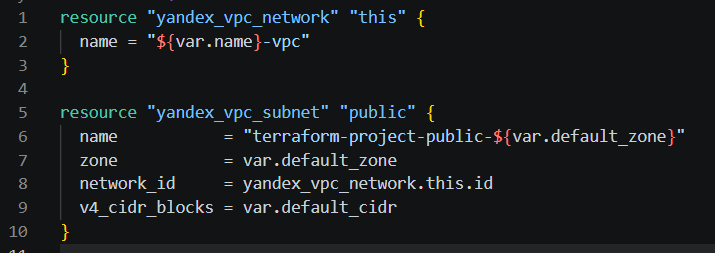
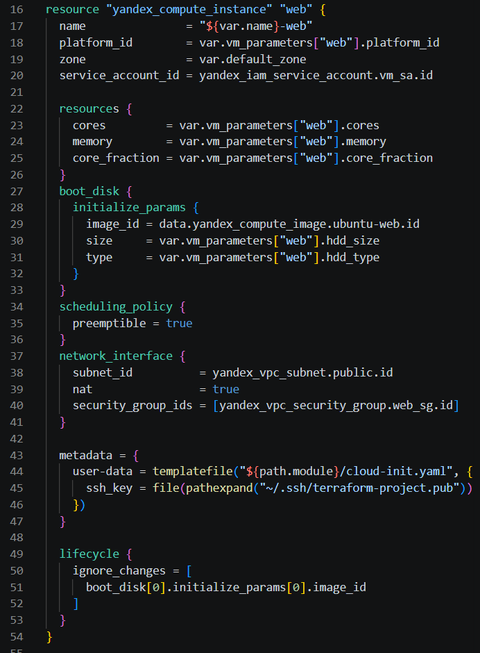
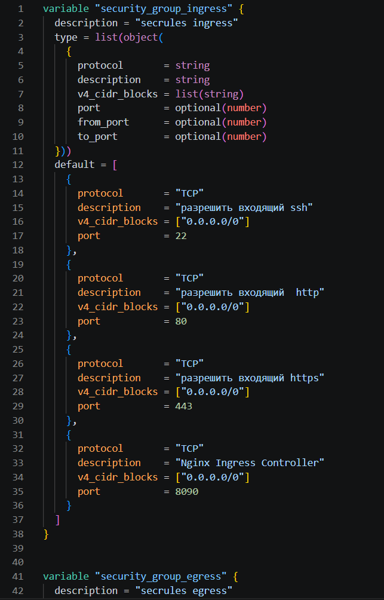
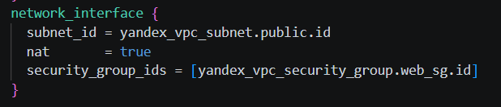
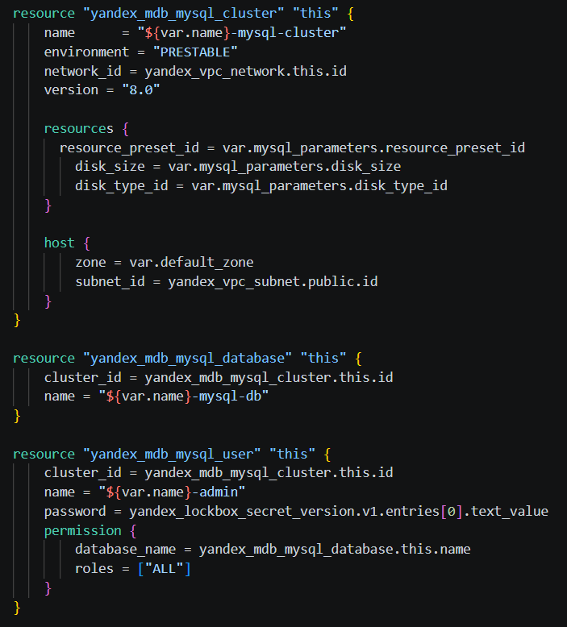
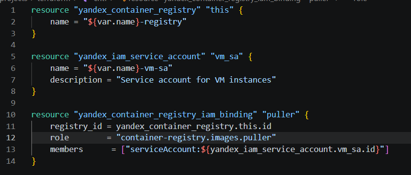

2

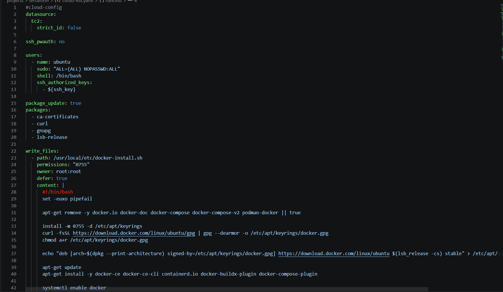
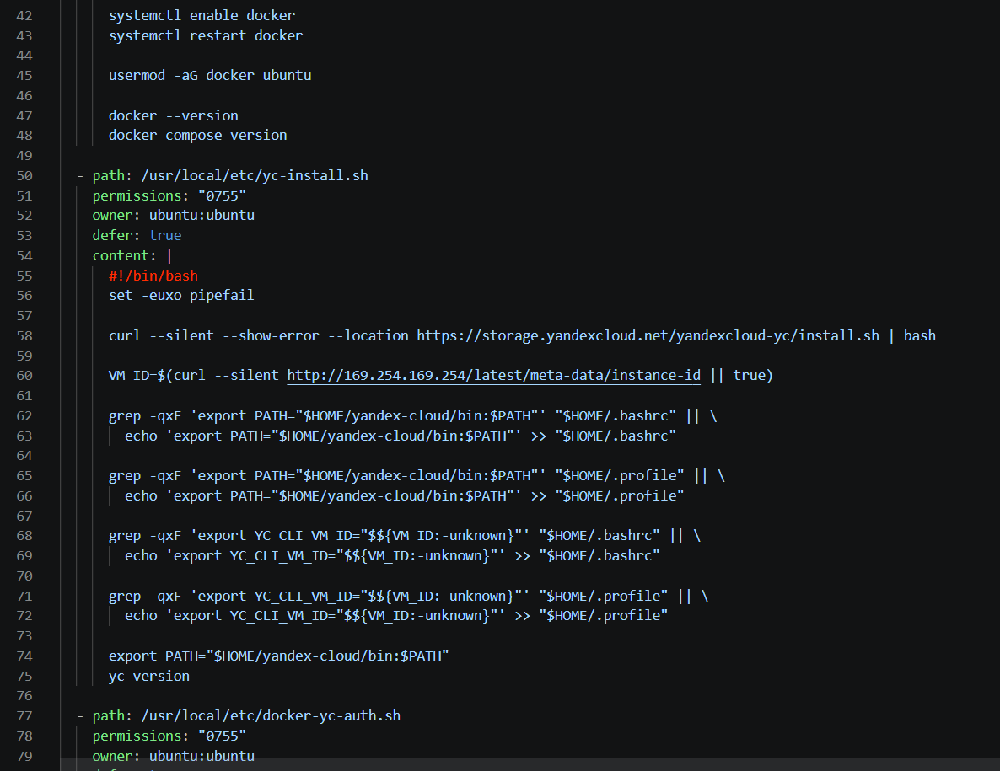
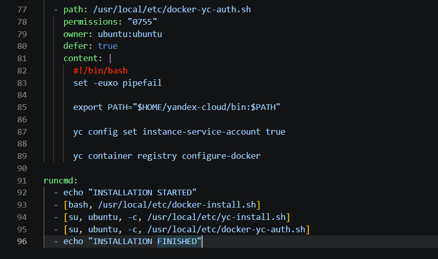

3
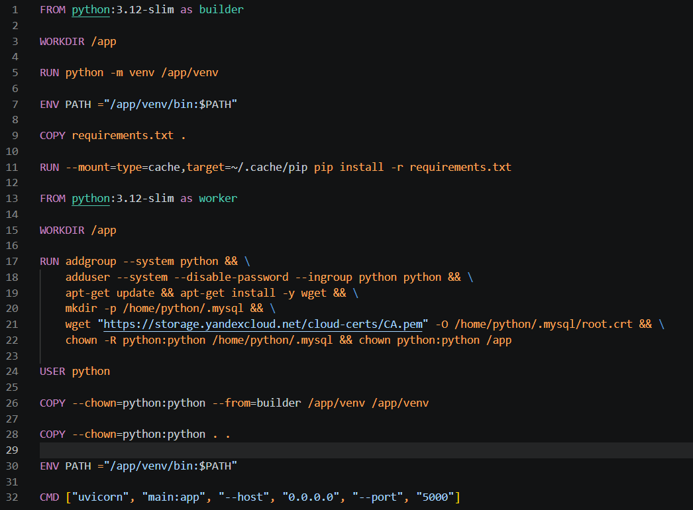

4

получил пароль для бд из локбокса
```
yc lockbox payload get --name terraform-project-mysql-password
```
подключился к ВМ, создал .env, вписал туда данные для бд
```
DB_HOST=rc1a-6tcgt8uu2qft626a.mdb.yandexcloud.net
DB_USER=terraform-project-admin
DB_PASSWORD=O0bXZRoEpu3oPvu6
DB_NAME=terraform-project-mysql-db
DB_SSL_CA=/home/python/.mysql/root.crt
```
написал compose.yml (пример в /docker) и запустил docker compose up -d (если первое подключение на сервере, то нужно сначала сделать newgrp docker для обновления групп)
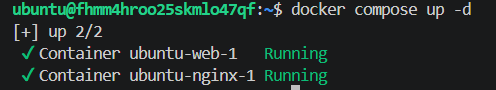

5
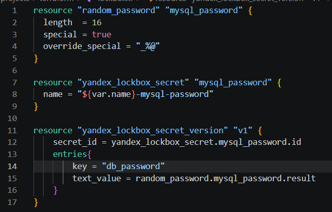

Чек-лист
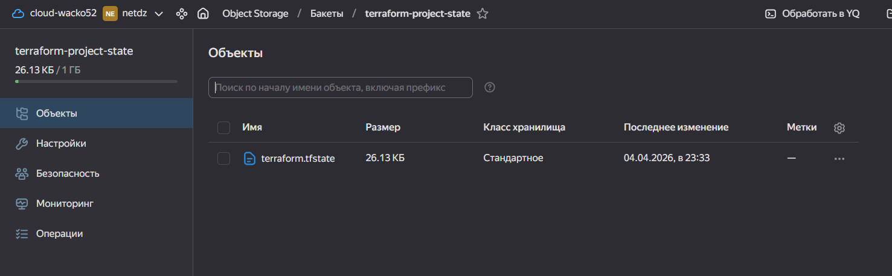
изменил в default.conf proxy_pass http://web:5000; и закинул оба конфига на сервер
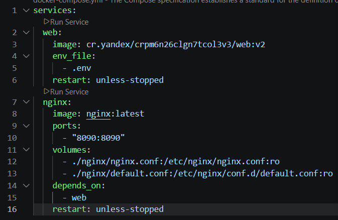
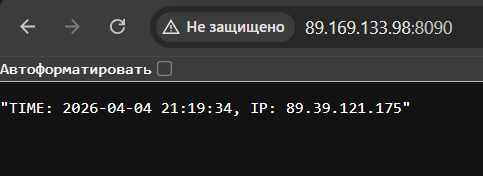
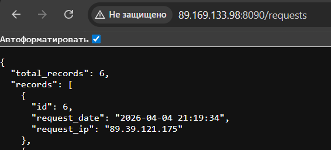

После завершения работы над проектом использовал terraform destroy