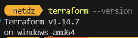
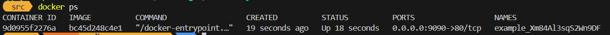
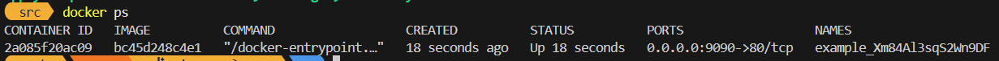
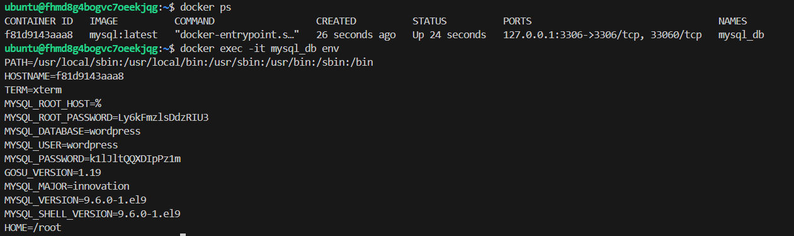

1.2 personal.auto.tfvars

1.3 "result": "Xm84Al3sqS2Wn9DF"

1.4 все ресурсы, должны иметь два названия, название ресурса должно начинаться с буквы или нижнего подчеркивания, а также опечатка в nginx(1nginx), допущенна ошибка в написании random_string_FAKE (FAKE лишнее), resulT опечатка должно быть result

1.5
```
resource "docker_image" "nginx"{
  name         = "nginx:latest"
  keep_locally = true
}

resource "docker_container" "nginx" {
  image = docker_image.nginx.image_id
  name  = "example_${random_password.random_string.result}"

  ports {
    internal = 80
    external = 9090
  }
}
```


1.6 при опечатках или ошибках применение без проверки может привести к плохим последствиям, пригодится может например для ci/cd и локальной разработки
 
 после нового apply изменилось имя контейнер назад на рандомное

1.7 
```
{
  "version": 4,
  "terraform_version": "1.14.7",
  "serial": 13,
  "lineage": "31cd385e-b97b-7848-c2f1-c9260b999251",
  "outputs": {},
  "resources": [],
  "check_results": null
}
```

1.8 потому что в ресурсе докера была строчка ```keep_locally = true```
keep_locally (Boolean) If true, then the Docker image won't be deleted on destroy operation. If this is false, it will delete the image from the docker local storage on destroy operation.

2

```
terraform {
  required_providers {
    yandex = {
      source  = "yandex-cloud/yandex"
      version = ">= 0.100.0"
    }
    docker = {
      source = "kreuzwerker/docker"
      version = "~> 3.0.0"
    }
    random = {
      source = "hashicorp/random"
      version = "~> 3.5.1"
    }
  }
}

provider docker {
  host = "ssh://ubuntu@${yandex_compute_instance.vm.network_interface.0.nat_ip_address}:22"
  ssh_opts = ["-o", "StrictHostKeyChecking=no", "-o", "UserKnownHostsFile=/dev/null", "-i", "./terraformDz1"]
}

resource "random_password" "mysql_root" {
  length  = 16
  special = false  
  min_upper   = 1
  min_lower   = 1
  min_numeric = 1
}

resource "random_password" "mysql_wordpress" {
  length  = 16
  special = false  
  min_upper   = 1
  min_lower   = 1
  min_numeric = 1
}

resource "docker_image" "mysql" {
  name         = "mysql:latest"
  keep_locally = false
}

resource "docker_container" "mysql" {
  name = "mysql_db"
  image = docker_image.mysql.name
  env = [
  "MYSQL_ROOT_PASSWORD=${random_password.mysql_root.result}",
  "MYSQL_DATABASE=wordpress",
  "MYSQL_USER=wordpress",
  "MYSQL_PASSWORD=${random_password.mysql_wordpress.result}",
  "MYSQL_ROOT_HOST=%"
  ]
  ports {
    internal = 3306
    external = 3306
    ip = "127.0.0.1"
  }
}

provider "yandex" {
  token     = var.yc_token
  cloud_id  = var.yc_cloud_id
  folder_id = var.yc_folder_id
  zone      = "ru-central1-a"
}

# Сеть и подсеть для ВМ
resource "yandex_vpc_network" "vpc_network" {
  name = "docker-network"
}

resource "yandex_vpc_subnet" "vpc_subnet" {
  name           = "docker-subnet"
  zone           = "ru-central1-a"
  network_id     = yandex_vpc_network.vpc_network.id
  v4_cidr_blocks = ["10.5.0.0/24"]
}

data "yandex_compute_image" "ubuntu" {
  family = "ubuntu-2204-lts"
}

resource "yandex_compute_instance" "vm" {
  name        = "docker-host"
  platform_id = "standard-v3"
  zone        = "ru-central1-a"

  resources {
    cores  = 2
    memory = 2
  }

  boot_disk {
    initialize_params {
      image_id = data.yandex_compute_image.ubuntu.id
      size     = 15
      type     = "network-hdd"
    }
  }

  network_interface {
    subnet_id = yandex_vpc_subnet.vpc_subnet.id
    nat       = true
  }

  metadata = {
    ssh-keys = "ubuntu:${file("terraformDz1.pub")}" 
  }
}

output "vm_public_ip" {
  description = "Публичный IP-адрес созданной ВМ"
  value       = yandex_compute_instance.vm.network_interface.0.nat_ip_address
}
```
