1.4 

Error: Invalid function argument, service_account_key_file = file("~/.authorized_key.json") - был указан путь к файлу которого нет на пк (мой ключ по другому называется)
```
metadata = {
    serial-port-enable = 1
    ssh-keys           = "ubuntu:${var.vms_ssh_root_key}"
  }
```
не передавался vms_ssh_public_root_key
в boot_disk не было указано тип и количество памяти
"standart-v4" опечатка и v4 несуществует, должно быть "standard-v3", также недоступно 5% ядра, изменил на 20 и повысил до 2 ядер, 2гб озу

1.6 

preemptible = true пригодится если забыл выключить ВМ, она автоматически оффнется через 24ч (экономия денег), core_fraction=5, конкретно в standard-v3 не был доступен, но в целом тоже ради экономии потому что используется не все ресурсы процессора на сервере
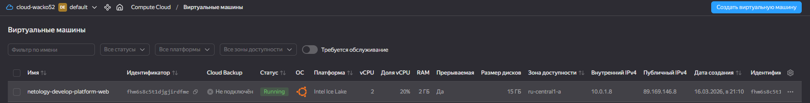
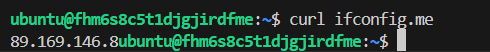

2
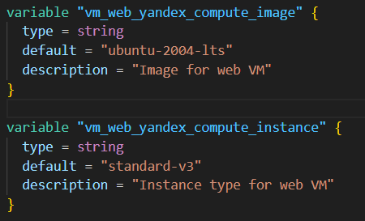
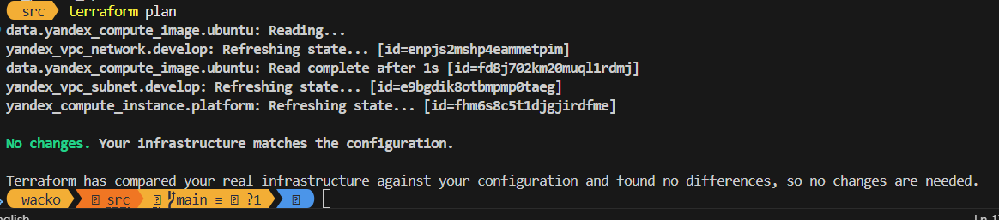

3
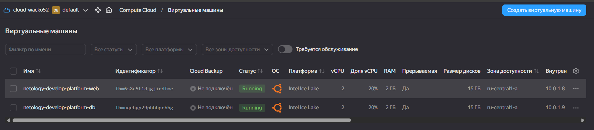
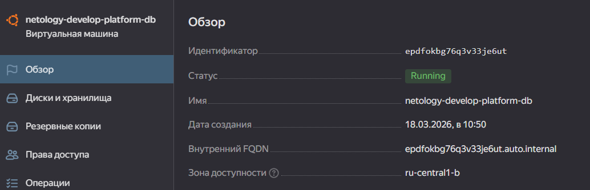

4

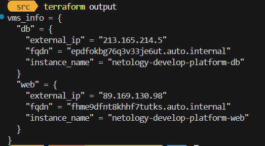

5
```
variable "project" {
  type = string
  default = "netology"
}

variable "env" {
  type = string
  default = "develop"
}

resource "yandex_compute_instance" "platform" {
  name        = local.platform

resource "yandex_compute_instance" "platform_db" {
  name = local.platform_db
```

6 

чуть увлекся и кроме трех переменных в условии, вынес и все остальные для удобства и использовал одну перменную vm_parametrs (vms_resources она изначально была, но начал добавлять туда другие переменные и поэтому изменил название) также объединил все в один файл variables, возможно отошел от условия задачи, но по моему код стал чище
6.2 использовал locals потому что в variable нельзя использовать функции
6.4 изменения есть, но потому что я поменял в db: озу, тип диска, и привел имена подсетей к более красивому виду (использовал также интерполяцию), а так все осталось на своих местах

7.1

local.test_list[1]

7.2

3

7.3

local.test_map["admin"]

7.4

```
"${local.test_map["admin"]} is ${[for k, v in local.test_map : k if v == "John"][0]} for ${local.test_list[2]} server based on OS ${local.servers["production"].image} with ${local.servers["production"].cpu} cpu, ${local.servers["production"].ram} ram and ${length(local.servers["production"].disks)} virtual disks"
```

8.2

local.test[0]["dev1"][0]

9
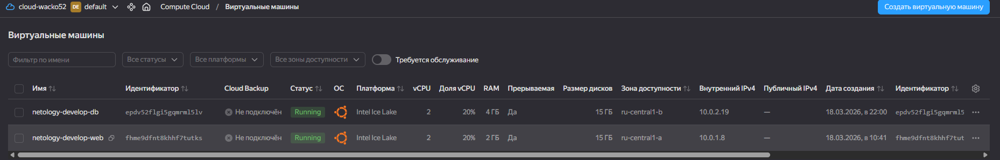
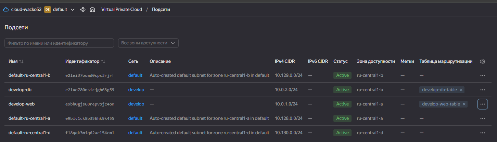
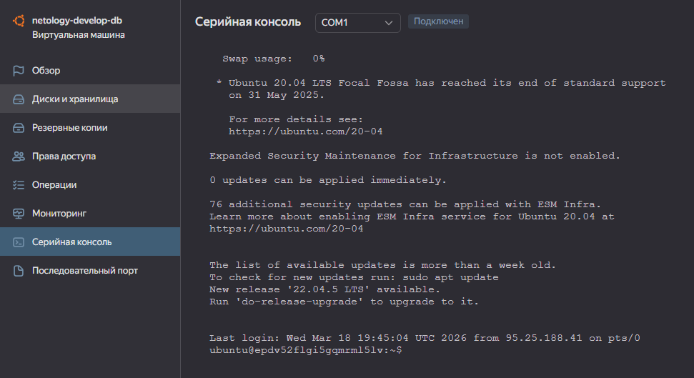
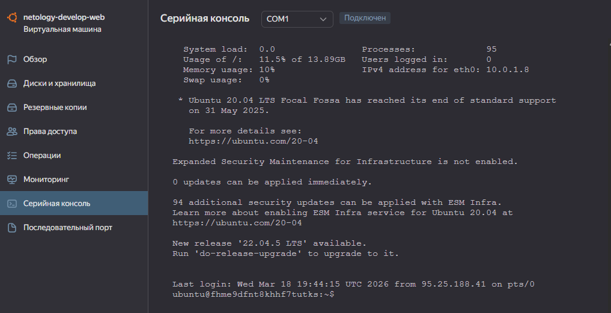