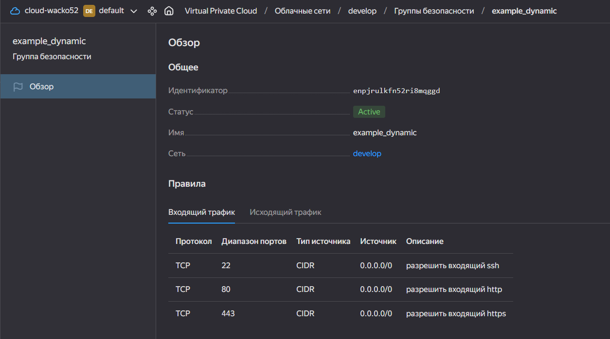
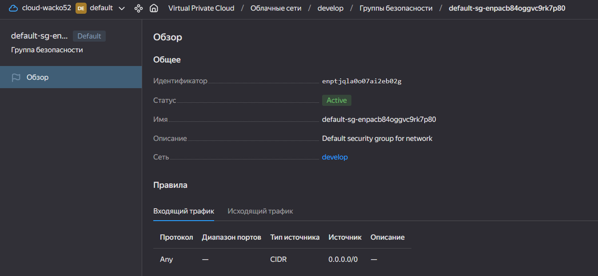
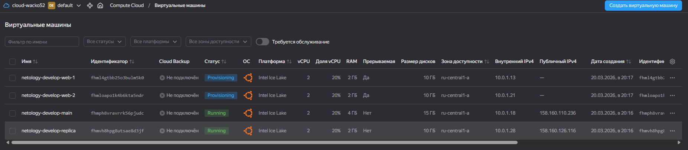
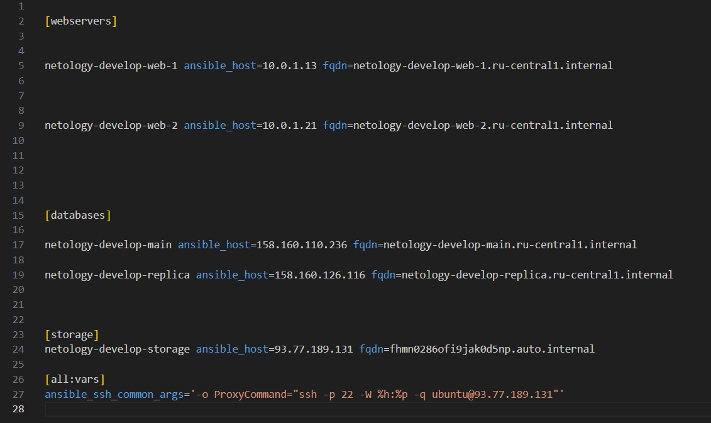
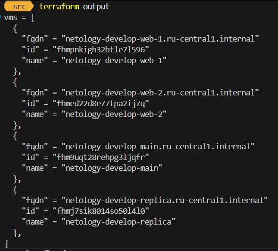

1


2.1
```
resource "yandex_compute_instance" "web" {
    count = 2

    platform_id = var.vm_resources.platform_id
    name = "netology-${var.vpc_name}-web-${count.index + 1}" 
    hostname = "netology-${var.vpc_name}-web-${count.index + 1}"
    resources {
        cores = var.vm_resources.cores
        memory = var.vm_resources.memory
        core_fraction = var.vm_resources.core_fraction
    }
    boot_disk {
        initialize_params {
            image_id = data.yandex_compute_image.ubuntu-develop.id
            size = var.vm_resources.hdd_size
            type = var.vm_resources.hdd_type
        }
    }
    scheduling_policy {
        preemptible = true
    }
    
    network_interface {
        subnet_id = yandex_vpc_subnet.develop.id
        nat = false
        security_group_ids = [yandex_vpc_security_group.example.id]
    }
}
```
2.2
```
data "yandex_compute_image" "ubuntu-develop" {
  family = "ubuntu-2004-lts"
}

resource "yandex_compute_instance" "db"{
    for_each = { for vm in var.each_vm : vm.vm_name => vm }

    name = "netology-${var.vpc_name}-${each.key}"
    hostname = "netology-${var.vpc_name}-${each.key}"

    platform_id = each.value.platform_id

    resources {
      cores = each.value.cpu
      ram = each.value.ram
      core_fraction = each.value.core_fraction
    }

    boot_disk {
      initialize_params {
        image_id = data.yandex_compute_image.ubuntu-develop.id
        size = each.value.disk_volume
        type = each.value.type
      }
    }

    scheduling_policy {
      preemptible = false
    }

    network_interface {
      subnet_id = yandex_vpc_subnet.subnet.id
      nat = true
    }
}
```
2.4
```
resource "yandex_compute_instance" "web" {
    depends_on = [ data.yandex_compute_instance.db ]
}
```
2.5
```
locals {
    pub_key = {
        serial-port-enable = "1"
        ssh-keys = "ubuntu:${file("~/.ssh/id_ed25519.pub")}"
    }
}
```
2.6

открыл публичный ip у бд, а у веба нет, но в задании ничего не было указано и я выставлял на рандом, заметил в консоли ЯК

3.1
```
resource "yandex_compute_disk" "vdisk" {
  count = 3
  name  = "netology-${var.vpc_name}-disk-${count.index + 1}"
  zone  = var.default_zone
  type  = var.disk_resources.type
  size  = var.disk_resources.size
}
```
3.2
```
resource "yandex_compute_instance" "storage" {
  name        = "netology-${var.vpc_name}-storage"
  platform_id = var.storage_resources.platform_id
  zone        = var.default_zone
  resources {
    cores         = var.storage_resources.cores
    memory        = var.storage_resources.memory
    core_fraction = var.storage_resources.core_fraction
  }
  boot_disk {
    initialize_params {
      image_id = data.yandex_compute_image.ubuntu-storage.id
      size     = var.storage_resources.size
      type     = var.storage_resources.type
    }
  }
  dynamic "secondary_disk" {
    for_each = yandex_compute_disk.vdisk
    content {
      disk_id = secondary_disk.value.id
    }
  }
  scheduling_policy {
    preemptible = true
  }
  network_interface {
    subnet_id          = yandex_vpc_subnet.develop.id
    nat                = true
  }
  
}
```
4

у веб серверов нат отключен поэтому выводится внутренний

5


7
```
{
network_id=local.vpc.network_id
subnet_ids=concat(slice(local.vpc.subnet_ids, 0, 2), slice(local.vpc.subnet_ids, 3, length(local.vpc.subnet_ids)))
subnet_zones=concat(slice(local.vpc.subnet_zones, 0, 2), slice(local.vpc.subnet_zones, 3, length(local.vpc.subnet_zones)))
}
```

8
```
[webservers]
%{~ for i in webservers ~}
${i["name"]} ansible_host=${i["network_interface"][0]["nat_ip_address"]} platform_id=${i["platform_id"]}
%{~ endfor ~}
```

9

```[for i in range(1, 100) : format("rc%02d", i)]```
```
[for i in range(1, 97) : 
  format("rc%02d", i) 
  if i == 19 || !contains([0, 7, 8, 9], i % 10)
]
```