1
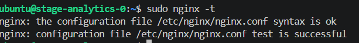
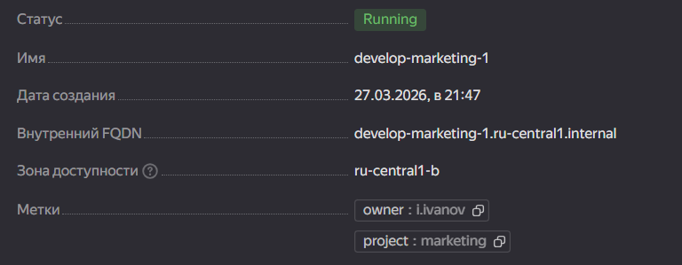
```
> module.a-vm
{
  "all" = [
    {
      "allow_recreate" = tobool(null)
      "allow_stopping_for_update" = true
      "boot_disk" = tolist([
        {
          "auto_delete" = true
          "device_name" = "fhmic7p2e0t1hpb8e7e6"
          "disk_id" = "fhmic7p2e0t1hpb8e7e6"
          "initialize_params" = tolist([
            {
              "block_size" = 4096
              "description" = ""
              "image_id" = "fd8ufem4ie73rl9g80jd"
              "kms_key_id" = ""
              "name" = ""
              "size" = 10
              "snapshot_id" = ""
              "type" = "network-hdd"
            },
          ])
          "mode" = "READ_WRITE"
        },
      ])
      "created_at" = "2026-03-27T18:47:16Z"
      "description" = "TODO: description; {{terraform yyy managed}}"
      "filesystem" = toset([])
      "folder_id" = "b1g2tm3nfs0k8rodelqc"
      "fqdn" = "stage-analytics-0.ru-central1.internal"
      "gpu_cluster_id" = ""
      "hardware_generation" = tolist([
        {
          "generation2_features" = tolist([])
          "legacy_features" = tolist([
            {
              "pci_topology" = "PCI_TOPOLOGY_V2"
            },
          ])
        },
      ])
      "hostname" = "stage-analytics-0"
      "id" = "fhm85uglvogt9ach9o1f"
      "labels" = tomap({
        "owner" = "p.petrov"
        "project" = "analytics"
      })
      "local_disk" = tolist([])
      "maintenance_grace_period" = ""
      "maintenance_policy" = tostring(null)
      "metadata" = tomap({
        "serial-port-enable" = "1"
        "user-data" = <<-EOT
        #cloud-config
        users:
          - name: ubuntu
            groups: sudo
            shell: /bin/bash
            sudo: ["ALL=(ALL) NOPASSWD:ALL"]
            ssh_authorized_keys:
              - ssh-ed25519 AAAAC3NzaC1lZDI1NTE5AAAAIBLiqGbjFqLCl+Sf/U6cXbp87CMs7BIx/e2SPdR+UYop wacko@HONOR
        package_update: true
        package_upgrade: false
        packages:
          - nginx

        EOT
      })
      "metadata_options" = tolist([
        {
          "aws_v1_http_endpoint" = 1
          "aws_v1_http_token" = 2
          "gce_http_endpoint" = 1
          "gce_http_token" = 1
        },
      ])
      "name" = "stage-analytics-0"
      "network_acceleration_type" = "standard"
      "network_interface" = tolist([
        {
          "dns_record" = tolist([])
          "index" = 0
          "ip_address" = "10.0.2.12"
          "ipv4" = true
          "ipv6" = false
          "ipv6_address" = ""
          "ipv6_dns_record" = tolist([])
          "mac_address" = "d0:0d:82:fa:15:fe"
          "nat" = true
          "nat_dns_record" = tolist([])
          "nat_ip_address" = "158.160.58.156"
          "nat_ip_version" = "IPV4"
          "security_group_ids" = toset(null) /* of string */
          "subnet_id" = "e9buo56npcg4s7q69ir7"
        },
      ])
      "placement_policy" = tolist([
        {
          "host_affinity_rules" = tolist([])
          "placement_group_id" = ""
          "placement_group_partition" = 0
        },
      ])
      "platform_id" = "standard-v1"
      "resources" = tolist([
        {
          "core_fraction" = 5
          "cores" = 2
          "gpus" = 0
          "memory" = 1
        },
      ])
      "scheduling_policy" = tolist([
        {
          "preemptible" = true
        },
      ])
      "secondary_disk" = toset([])
      "service_account_id" = ""
      "status" = "running"
      "timeouts" = null /* object */
      "zone" = "ru-central1-a"
    },
  ]
  "external_ip_address" = [
    "158.160.58.156",
  ]
  "fqdn" = [
    "stage-analytics-0.ru-central1.internal",
  ]
  "internal_ip_address" = [
    "10.0.2.12",
  ]
  "labels" = [
    tomap({
      "owner" = "p.petrov"
      "project" = "analytics"
    }),
  ]
  "network_interface" = [
    tolist([
      {
        "dns_record" = tolist([])
        "index" = 0
        "ip_address" = "10.0.2.12"
        "ipv4" = true
        "ipv6" = false
        "ipv6_address" = ""
        "ipv6_dns_record" = tolist([])
        "mac_address" = "d0:0d:82:fa:15:fe"
        "nat" = true
        "nat_dns_record" = tolist([])
        "nat_ip_address" = "158.160.58.156"
        "nat_ip_version" = "IPV4"
        "security_group_ids" = toset(null) /* of string */
        "subnet_id" = "e9buo56npcg4s7q69ir7"
      },
    ]),
  ]
}
```
2.3
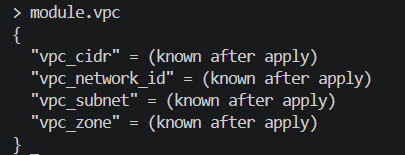
2.5
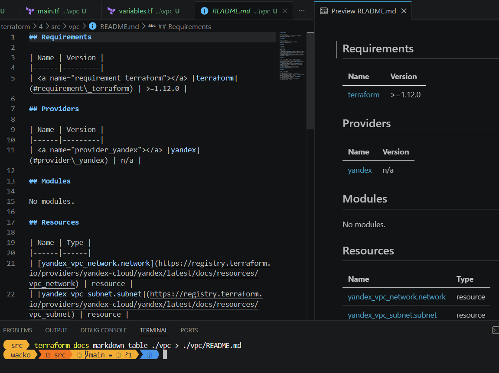

3
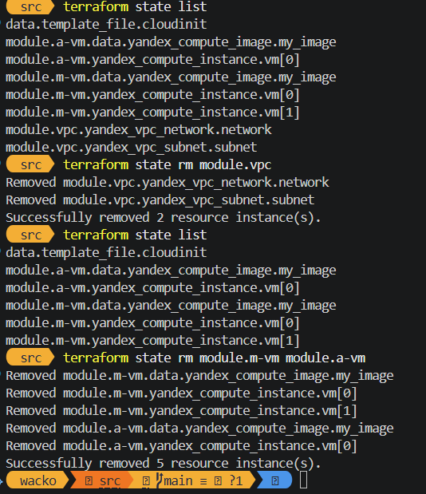
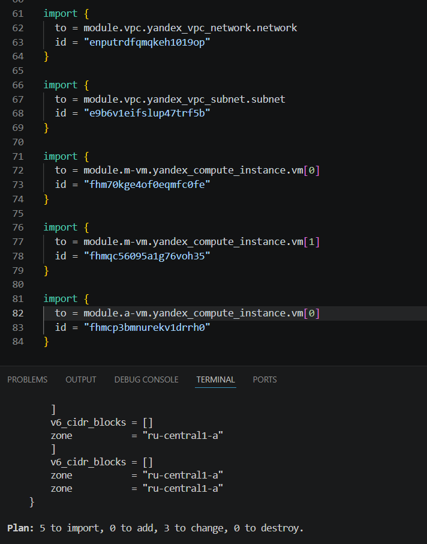

4
```
resource "yandex_vpc_network" "network" {
  name = var.env_name
}
resource "yandex_vpc_subnet" "subnet" {
  for_each = {for s in var.subnets : s.zone => s}
  name           = "${var.env_name}-${each.value.zone}"
  zone = each.value.zone
  v4_cidr_blocks = [each.value.cidr]
  network_id     = yandex_vpc_network.network.id
}
```
```
output "vpc_subnet_ids"{
    value = [for s in yandex_vpc_subnet.subnet : s.id]
}
output "vpc_zone"{
    value = [for s in yandex_vpc_subnet.subnet : s.zone]
}
output "vpc_network_id"{
    value = yandex_vpc_network.network.id    
}
output "vpc_cidr"{
    value = [for s in yandex_vpc_subnet.subnet : s.v4_cidr_blocks]
}
```
```
variable "subnets" {
  type = list(object({
    zone = string
    cidr = string
  }))
  description = "Default zone for resources"
}
```
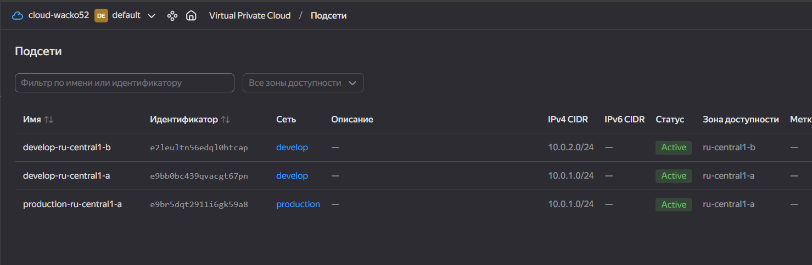

5.1
```
resource "yandex_mdb_mysql_cluster" "this" {
    name = var.cluster_name
    network_id = var.network_id
    environment = var.HA ? "PRODUCTION" : "PRESTABLE"
    version = "8.0"
    
    resources {
        resource_preset_id = var.cluster_resources.resource_preset_id
        disk_size = var.cluster_resources.disk_size
        disk_type_id = var.cluster_resources.disk_type_id
    }

    dynamic "host" {
        for_each = local.hosts_to_create
        content {
            zone = host.value.zone
            subnet_id = host.value.subnet_id
        }
    }
  
}
```
5.2
```
resource "yandex_mdb_mysql_database" "database" {
    cluster_id = var.cluster_id
    name = var.db_name
}

resource "yandex_mdb_mysql_user" "user" {
    cluster_id = var.cluster_id
    name = var.db_user
    password = var.db_password

    permission {
        database_name = yandex_mdb_mysql_database.database.name
        roles = ["ALL"]
    }
}
```
5.4
```
Terraform used the selected providers to generate the following execution plan. Resource actions are indicated with the following symbols:
  + create

Terraform will perform the following actions:

  # random_password.db_password will be created
  + resource "random_password" "db_password" {
      + bcrypt_hash = (sensitive value)
      + id          = (known after apply)
      + length      = 16
      + lower       = true
      + min_lower   = 0
      + min_numeric = 0
      + min_special = 0
      + min_upper   = 0
      + number      = true
      + numeric     = true
      + result      = (sensitive value)
      + special     = true
      + upper       = true
    }

  # module.a-vm.yandex_compute_instance.vm[0] will be created
  + resource "yandex_compute_instance" "vm" {
      + allow_stopping_for_update = true
      + created_at                = (known after apply)
      + description               = "TODO: description; {{terraform yyy managed}}"
      + folder_id                 = (known after apply)
      + fqdn                      = (known after apply)
      + gpu_cluster_id            = (known after apply)
      + hardware_generation       = (known after apply)
      + hostname                  = "production-analytics-0"
      + id                        = (known after apply)
      + labels                    = {
          + "owner"   = "p.petrov"
          + "project" = "analytics"
        }
      + maintenance_grace_period  = (known after apply)
      + maintenance_policy        = (known after apply)
      + metadata                  = {
          + "serial-port-enable" = "1"
          + "user-data"          = <<-EOT
                #cloud-config
                users:
                  - name: ubuntu
                    groups: sudo
                    shell: /bin/bash
                    sudo: ["ALL=(ALL) NOPASSWD:ALL"]
                    ssh_authorized_keys:
                      - ssh-ed25519 AAAAC3NzaC1lZDI1NTE5AAAAIBLiqGbjFqLCl+Sf/U6cXbp87CMs7BIx/e2SPdR+UYop wacko@HONOR
                package_update: true
                package_upgrade: false
                packages:
                  - nginx
            EOT
        }
      + name                      = "production-analytics-0"
      + network_acceleration_type = "standard"
      + platform_id               = "standard-v1"
      + status                    = (known after apply)
      + zone                      = "ru-central1-a"

      + boot_disk {
          + auto_delete = true
          + device_name = (known after apply)
          + disk_id     = (known after apply)
          + mode        = (known after apply)

          + initialize_params {
              + block_size  = (known after apply)
              + description = (known after apply)
              + image_id    = "fd8ufem4ie73rl9g80jd"
              + name        = (known after apply)
              + size        = 10
              + snapshot_id = (known after apply)
              + type        = "network-hdd"
            }
        }

      + metadata_options (known after apply)

      + network_interface {
          + index          = (known after apply)
          + ip_address     = (known after apply)
          + ipv4           = true
          + ipv6           = (known after apply)
          + ipv6_address   = (known after apply)
          + mac_address    = (known after apply)
          + nat            = true
          + nat_ip_address = (known after apply)
          + nat_ip_version = (known after apply)
          + subnet_id      = (known after apply)
        }

      + placement_policy (known after apply)

      + resources {
          + core_fraction = 5
          + cores         = 2
          + memory        = 1
        }

      + scheduling_policy {
          + preemptible = true
        }
    }

  # module.example_cluster.yandex_mdb_mysql_cluster.cluster will be created
  + resource "yandex_mdb_mysql_cluster" "cluster" {
      + allow_regeneration_host   = false
      + backup_retain_period_days = (known after apply)
      + created_at                = (known after apply)
      + deletion_protection       = (known after apply)
      + disk_encryption_key_id    = (known after apply)
      + environment               = "PRESTABLE"
      + folder_id                 = (known after apply)
      + health                    = (known after apply)
      + host_group_ids            = (known after apply)
      + id                        = (known after apply)
      + mysql_config              = (known after apply)
      + name                      = "example-mysql-cluster"
      + network_id                = (known after apply)
      + status                    = (known after apply)
      + version                   = "8.0"

      + access (known after apply)

      + backup_window_start (known after apply)

      + disk_size_autoscaling (known after apply)

      + host {
          + assign_public_ip   = false
          + fqdn               = (known after apply)
          + replication_source = (known after apply)
          + subnet_id          = (known after apply)
          + zone               = "ru-central1-a"
        }

      + maintenance_window (known after apply)

      + performance_diagnostics (known after apply)

      + resources {
          + disk_size          = 10
          + disk_type_id       = "network-ssd"
          + resource_preset_id = "s2.micro"
        }
    }

  # module.example_db.yandex_mdb_mysql_database.database will be created
  + resource "yandex_mdb_mysql_database" "database" {
      + cluster_id = (known after apply)
      + id         = (known after apply)
      + name       = "test"
    }

  # module.example_db.yandex_mdb_mysql_user.user will be created
  + resource "yandex_mdb_mysql_user" "user" {
      + authentication_plugin = (known after apply)
      + cluster_id            = (known after apply)
      + connection_manager    = (known after apply)
      + generate_password     = false
      + id                    = (known after apply)
      + name                  = "app"
      + password              = (sensitive value)

      + connection_limits (known after apply)

      + permission {
          + database_name = "test"
          + roles         = [
              + "ALL",
            ]
        }
    }

  # module.m-vm.yandex_compute_instance.vm[0] will be created
  + resource "yandex_compute_instance" "vm" {
      + allow_stopping_for_update = true
      + created_at                = (known after apply)
      + description               = "TODO: description; {{terraform yyy managed}}"
      + folder_id                 = (known after apply)
      + fqdn                      = (known after apply)
      + gpu_cluster_id            = (known after apply)
      + hardware_generation       = (known after apply)
      + hostname                  = "develop-marketing-0"
      + id                        = (known after apply)
      + labels                    = {
          + "owner"   = "i.ivanov"
          + "project" = "marketing"
        }
      + maintenance_grace_period  = (known after apply)
      + maintenance_policy        = (known after apply)
      + metadata                  = {
          + "serial-port-enable" = "1"
          + "user-data"          = <<-EOT
                #cloud-config
                users:
                  - name: ubuntu
                    groups: sudo
                    shell: /bin/bash
                    sudo: ["ALL=(ALL) NOPASSWD:ALL"]
                    ssh_authorized_keys:
                      - ssh-ed25519 AAAAC3NzaC1lZDI1NTE5AAAAIBLiqGbjFqLCl+Sf/U6cXbp87CMs7BIx/e2SPdR+UYop wacko@HONOR
                package_update: true
                package_upgrade: false
                packages:
                  - nginx
            EOT
        }
      + name                      = "develop-marketing-0"
      + network_acceleration_type = "standard"
      + platform_id               = "standard-v1"
      + status                    = (known after apply)
      + zone                      = "ru-central1-a"

      + boot_disk {
          + auto_delete = true
          + device_name = (known after apply)
          + disk_id     = (known after apply)
          + mode        = (known after apply)

          + initialize_params {
              + block_size  = (known after apply)
              + description = (known after apply)
              + image_id    = "fd8ufem4ie73rl9g80jd"
              + name        = (known after apply)
              + size        = 10
              + snapshot_id = (known after apply)
              + type        = "network-hdd"
            }
        }

      + metadata_options (known after apply)

      + network_interface {
          + index          = (known after apply)
          + ip_address     = (known after apply)
          + ipv4           = true
          + ipv6           = (known after apply)
          + ipv6_address   = (known after apply)
          + mac_address    = (known after apply)
          + nat            = true
          + nat_ip_address = (known after apply)
          + nat_ip_version = (known after apply)
          + subnet_id      = (known after apply)
        }

      + placement_policy (known after apply)

      + resources {
          + core_fraction = 5
          + cores         = 2
          + memory        = 1
        }

      + scheduling_policy {
          + preemptible = true
        }
    }

  # module.m-vm.yandex_compute_instance.vm[1] will be created
  + resource "yandex_compute_instance" "vm" {
      + allow_stopping_for_update = true
      + created_at                = (known after apply)
      + description               = "TODO: description; {{terraform yyy managed}}"
      + folder_id                 = (known after apply)
      + fqdn                      = (known after apply)
      + gpu_cluster_id            = (known after apply)
      + hardware_generation       = (known after apply)
      + hostname                  = "develop-marketing-1"
      + id                        = (known after apply)
      + labels                    = {
          + "owner"   = "i.ivanov"
          + "project" = "marketing"
        }
      + maintenance_grace_period  = (known after apply)
      + maintenance_policy        = (known after apply)
      + metadata                  = {
          + "serial-port-enable" = "1"
          + "user-data"          = <<-EOT
                #cloud-config
                users:
                  - name: ubuntu
                    groups: sudo
                    shell: /bin/bash
                    sudo: ["ALL=(ALL) NOPASSWD:ALL"]
                    ssh_authorized_keys:
                      - ssh-ed25519 AAAAC3NzaC1lZDI1NTE5AAAAIBLiqGbjFqLCl+Sf/U6cXbp87CMs7BIx/e2SPdR+UYop wacko@HONOR
                package_update: true
                package_upgrade: false
                packages:
                  - nginx
            EOT
        }
      + name                      = "develop-marketing-1"
      + network_acceleration_type = "standard"
      + platform_id               = "standard-v1"
      + status                    = (known after apply)
      + zone                      = "ru-central1-b"

      + boot_disk {
          + auto_delete = true
          + device_name = (known after apply)
          + disk_id     = (known after apply)
          + mode        = (known after apply)

          + initialize_params {
              + block_size  = (known after apply)
              + description = (known after apply)
              + image_id    = "fd8ufem4ie73rl9g80jd"
              + name        = (known after apply)
              + size        = 10
              + snapshot_id = (known after apply)
              + type        = "network-hdd"
            }
        }

      + metadata_options (known after apply)

      + network_interface {
          + index          = (known after apply)
          + ip_address     = (known after apply)
          + ipv4           = true
          + ipv6           = (known after apply)
          + ipv6_address   = (known after apply)
          + mac_address    = (known after apply)
          + nat            = true
          + nat_ip_address = (known after apply)
          + nat_ip_version = (known after apply)
          + subnet_id      = (known after apply)
        }

      + placement_policy (known after apply)

      + resources {
          + core_fraction = 5
          + cores         = 2
          + memory        = 1
        }

      + scheduling_policy {
          + preemptible = true
        }
    }

  # module.vpc_dev.yandex_vpc_network.network will be created
  + resource "yandex_vpc_network" "network" {
      + created_at                = (known after apply)
      + default_security_group_id = (known after apply)
      + folder_id                 = (known after apply)
      + id                        = (known after apply)
      + labels                    = (known after apply)
      + name                      = "develop"
      + subnet_ids                = (known after apply)
    }

  # module.vpc_dev.yandex_vpc_subnet.subnet["ru-central1-a"] will be created
  + resource "yandex_vpc_subnet" "subnet" {
      + created_at     = (known after apply)
      + folder_id      = (known after apply)
      + id             = (known after apply)
      + labels         = (known after apply)
      + name           = "develop-ru-central1-a"
      + network_id     = (known after apply)
      + v4_cidr_blocks = [
          + "10.0.1.0/24",
        ]
      + v6_cidr_blocks = (known after apply)
      + zone           = "ru-central1-a"
    }

  # module.vpc_dev.yandex_vpc_subnet.subnet["ru-central1-b"] will be created
  + resource "yandex_vpc_subnet" "subnet" {
      + created_at     = (known after apply)
      + folder_id      = (known after apply)
      + id             = (known after apply)
      + labels         = (known after apply)
      + name           = "develop-ru-central1-b"
      + network_id     = (known after apply)
      + v4_cidr_blocks = [
          + "10.0.2.0/24",
        ]
      + v6_cidr_blocks = (known after apply)
      + zone           = "ru-central1-b"
    }

  # module.vpc_prod.yandex_vpc_network.network will be created
  + resource "yandex_vpc_network" "network" {
      + created_at                = (known after apply)
      + default_security_group_id = (known after apply)
      + folder_id                 = (known after apply)
      + id                        = (known after apply)
      + labels                    = (known after apply)
      + name                      = "production"
      + subnet_ids                = (known after apply)
    }

  # module.vpc_prod.yandex_vpc_subnet.subnet["ru-central1-a"] will be created
  + resource "yandex_vpc_subnet" "subnet" {
      + created_at     = (known after apply)
      + folder_id      = (known after apply)
      + id             = (known after apply)
      + labels         = (known after apply)
      + name           = "production-ru-central1-a"
      + network_id     = (known after apply)
      + v4_cidr_blocks = [
          + "10.0.1.0/24",
        ]
      + v6_cidr_blocks = (known after apply)
      + zone           = "ru-central1-a"
    }

Plan: 12 to add, 0 to change, 0 to destroy.

Changes to Outputs:
  + analytics_vm_public_ips = (known after apply)
  + marketing_vm_public_ips = (known after apply)
```

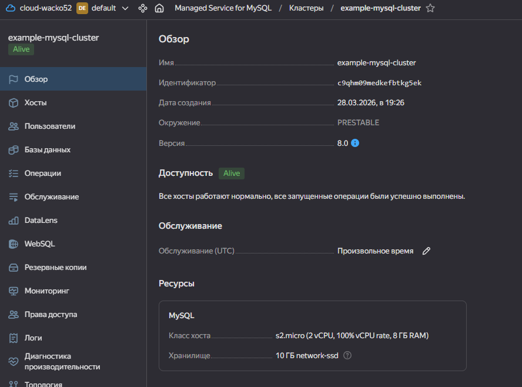
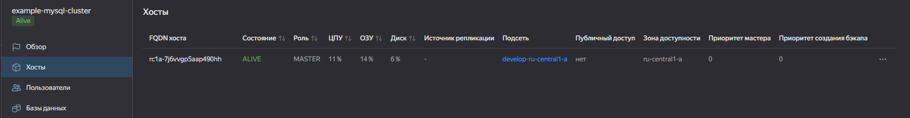

не хватило в проде подсетей, поэтому пришлось добавлять, но увидел, что не хватает после apply, еще и переключал на дев подсети, короче вылезло много ошибок, почистил state потому что бд сохранилась, а кластер удалился, потом добавил подсети в прод, выставил HA = false пересоздал кластер и потом выставил true, создал с двумя хостами

```
Terraform used the selected providers to generate the following execution plan. Resource actions are indicated with the following symbols:
  ~ update in-place
-/+ destroy and then create replacement

Terraform will perform the following actions:

  # module.example_cluster.yandex_mdb_mysql_cluster.cluster must be replaced
-/+ resource "yandex_mdb_mysql_cluster" "cluster" {
      ~ backup_retain_period_days = 7 -> (known after apply)
      ~ created_at                = "2026-03-28T16:44:31Z" -> (known after apply)
      ~ deletion_protection       = false -> (known after apply)
      + disk_encryption_key_id    = (known after apply)
      ~ environment               = "PRESTABLE" -> "PRODUCTION" # forces replacement
      ~ folder_id                 = "b1g2tm3nfs0k8rodelqc" -> (known after apply)
      ~ health                    = "ALIVE" -> (known after apply)
      ~ host_group_ids            = [] -> (known after apply)
      ~ id                        = "c9qlegvtq4ir5vhfpj91" -> (known after apply)
      - labels                    = {} -> null
      ~ mysql_config              = {
          - "binlog_transaction_dependency_tracking" = "0"
          - "sql_mode"                               = "ONLY_FULL_GROUP_BY,STRICT_TRANS_TABLES,NO_ZERO_IN_DATE,NO_ZERO_DATE,ERROR_FOR_DIVISION_BY_ZERO,NO_ENGINE_SUBSTITUTION"
        } -> (known after apply)
        name                      = "example-mysql-cluster"
      ~ network_id                = "enpeomvhu1vmhirhqqm8" -> "enpi3ftue3fjnsjadv6t" # forces replacement
      - security_group_ids        = [] -> null
      ~ status                    = "RUNNING" -> (known after apply)
        # (3 unchanged attributes hidden)

      ~ access (known after apply)
      - access {
          - data_lens     = false -> null
          - data_transfer = false -> null
          - web_sql       = false -> null
          - yandex_query  = false -> null
        }

      ~ backup_window_start (known after apply)
      - backup_window_start {
          - hours   = 0 -> null
          - minutes = 0 -> null
        }

      ~ disk_size_autoscaling (known after apply)
      - disk_size_autoscaling {
          - disk_size_limit           = 0 -> null
          - emergency_usage_threshold = 0 -> null
          - planned_usage_threshold   = 0 -> null
        }

      ~ host {
          - backup_priority         = 0 -> null
          ~ fqdn                    = "rc1a-uk090t1d1itadnvp.mdb.yandexcloud.net" -> (known after apply)
            name                    = null
          - priority                = 0 -> null
          + replication_source      = (known after apply)
          ~ subnet_id               = "e9bf8es13nkmj56pk0ej" -> "e9buivikp1guip8j39bp"
            # (3 unchanged attributes hidden)
        }
      + host {
          + assign_public_ip   = false
          + fqdn               = (known after apply)
          + replication_source = (known after apply)
          + subnet_id          = "e2lr1s9k31rv3ohi5tl6"
          + zone               = "ru-central1-b"
        }

      ~ maintenance_window (known after apply)
      - maintenance_window {
          - hour = 0 -> null
          - type = "ANYTIME" -> null
            # (1 unchanged attribute hidden)
        }

      ~ performance_diagnostics (known after apply)
      - performance_diagnostics {
          - enabled                      = false -> null
          - sessions_sampling_interval   = 60 -> null
          - statements_sampling_interval = 600 -> null
        }

      ~ resources {
          ~ disk_size          = 10 -> 20
            # (2 unchanged attributes hidden)
        }
    }

  # module.example_db.yandex_mdb_mysql_database.database will be updated in-place
  ~ resource "yandex_mdb_mysql_database" "database" {
      ~ cluster_id = "c9qlegvtq4ir5vhfpj91" -> (known after apply)
        id         = "c9qlegvtq4ir5vhfpj91:test"
        name       = "test"
    }

  # module.example_db.yandex_mdb_mysql_user.user must be replaced
-/+ resource "yandex_mdb_mysql_user" "user" {
      + authentication_plugin = (known after apply)
      ~ cluster_id            = "c9qlegvtq4ir5vhfpj91" -> (known after apply) # forces replacement
      ~ connection_manager    = {
          - "connection_id" = "a59rf02nmb5uqpb8ucmg"
        } -> (known after apply)
      - global_permissions    = [] -> null
      ~ id                    = "c9qlegvtq4ir5vhfpj91:app" -> (known after apply)
        name                  = "app"
        # (2 unchanged attributes hidden)

      ~ connection_limits (known after apply)

        # (1 unchanged block hidden)
    }

Plan: 2 to add, 1 to change, 2 to destroy.
```
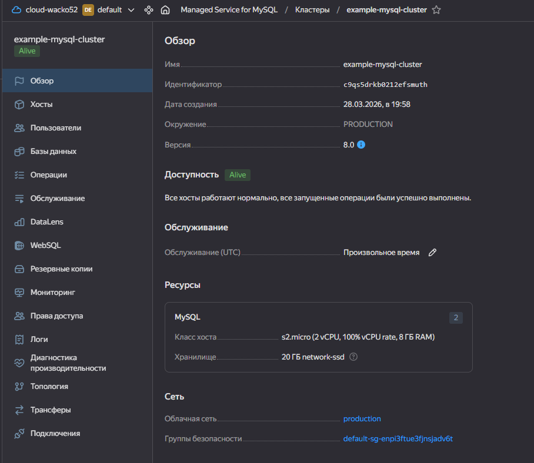
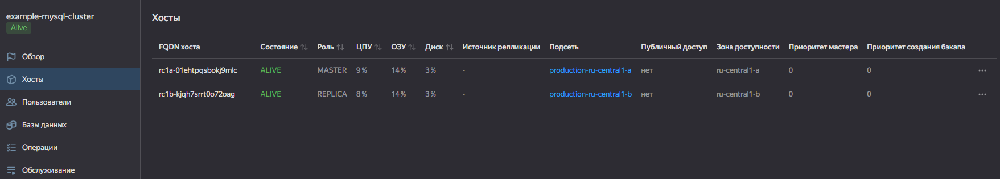

6
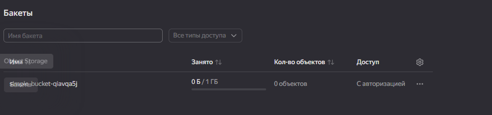

7
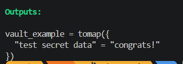
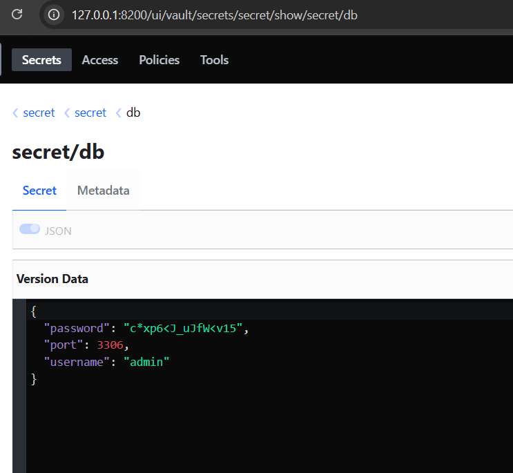
```
resource random_password "password" {
  length  = 16
  special = true
}

resource "vault_kv_secret_v2" "db_creds" {
  mount = "secret"

  name = "secret/db"

  data_json = jsonencode({
    username = "admin"
    password = random_password.password.result
    port = 3306
  })
  
}
```

