1
src/
tflint:
не указана версия провайдера
переменная объявлена, но не используется
checkov: нет ошибок

demonstration1/
tflint: нет ошибок
checkov: 
использование ремоут модуля через ветку, а не хеш коммита или тег

2
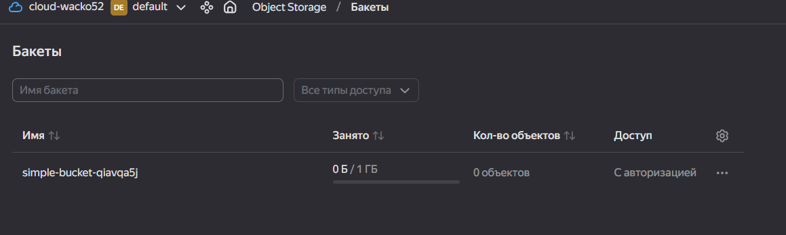
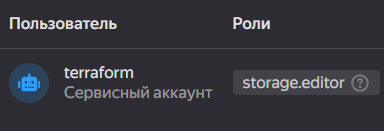
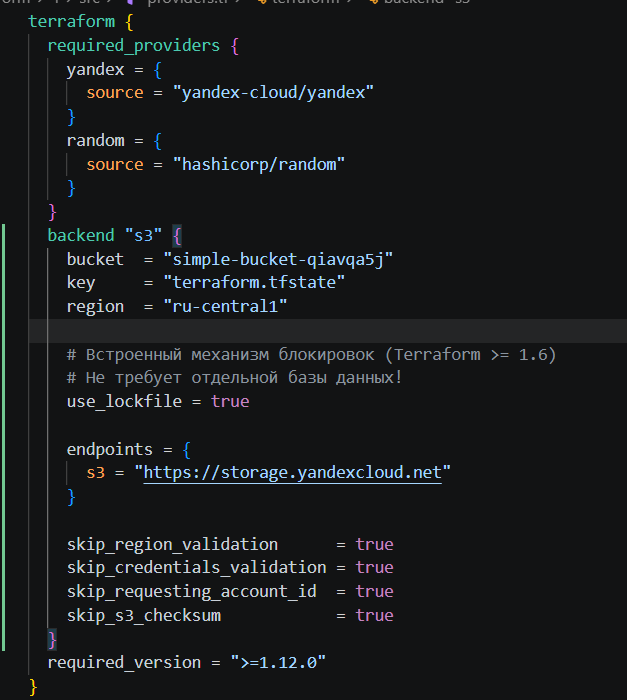
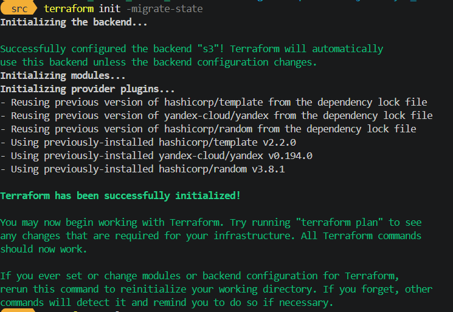
после terraform apply
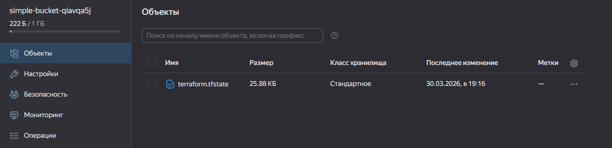
2.5
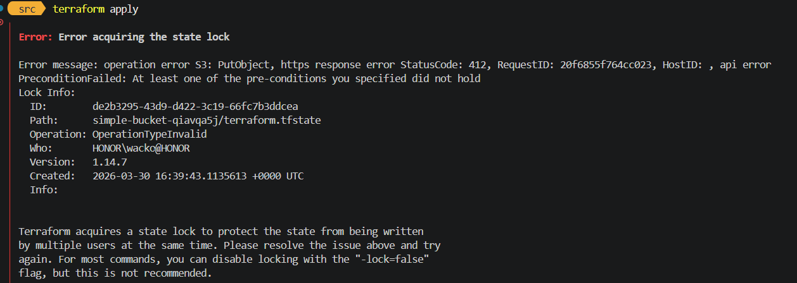
2.6
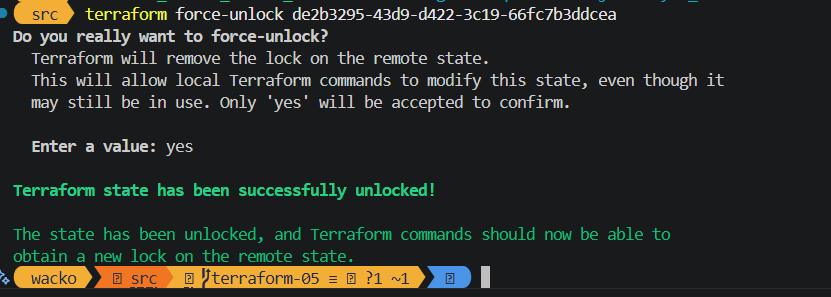

3
https://github.com/wacko-io/netdz/pull/1

4
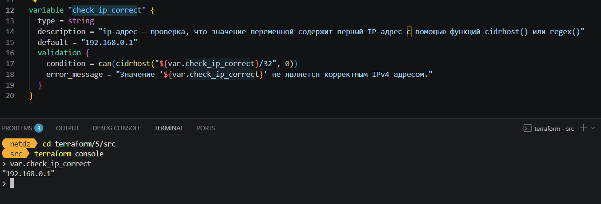
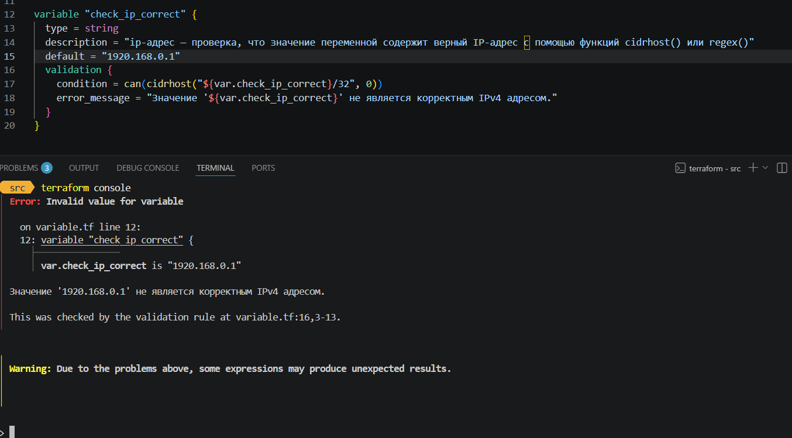
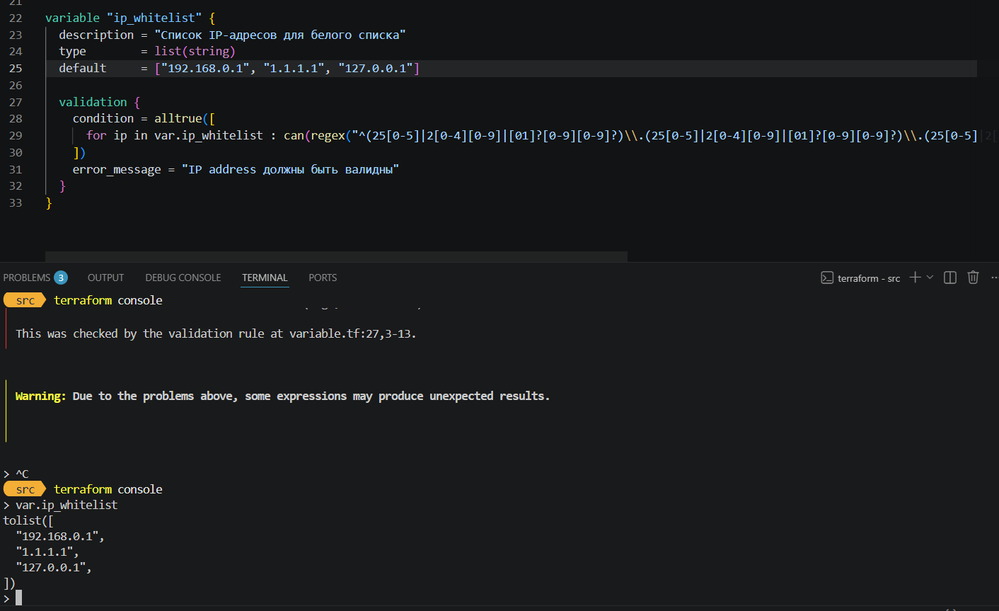
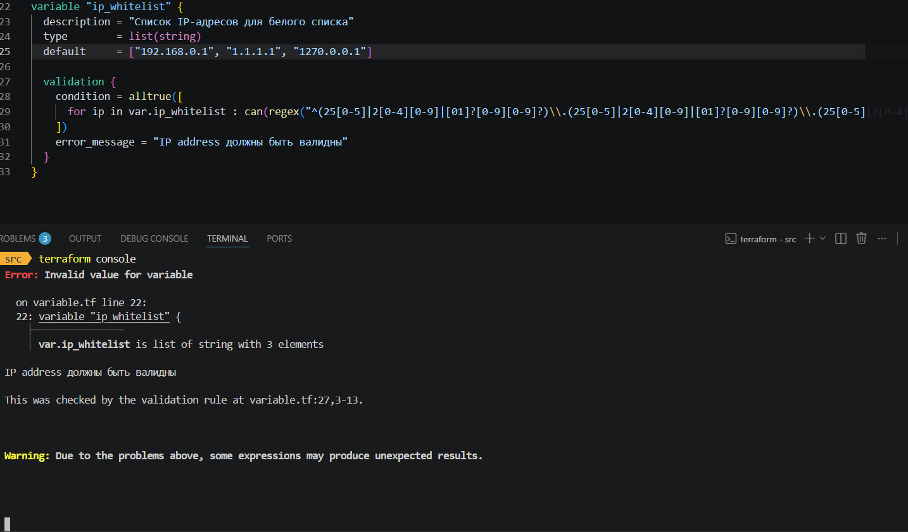

5
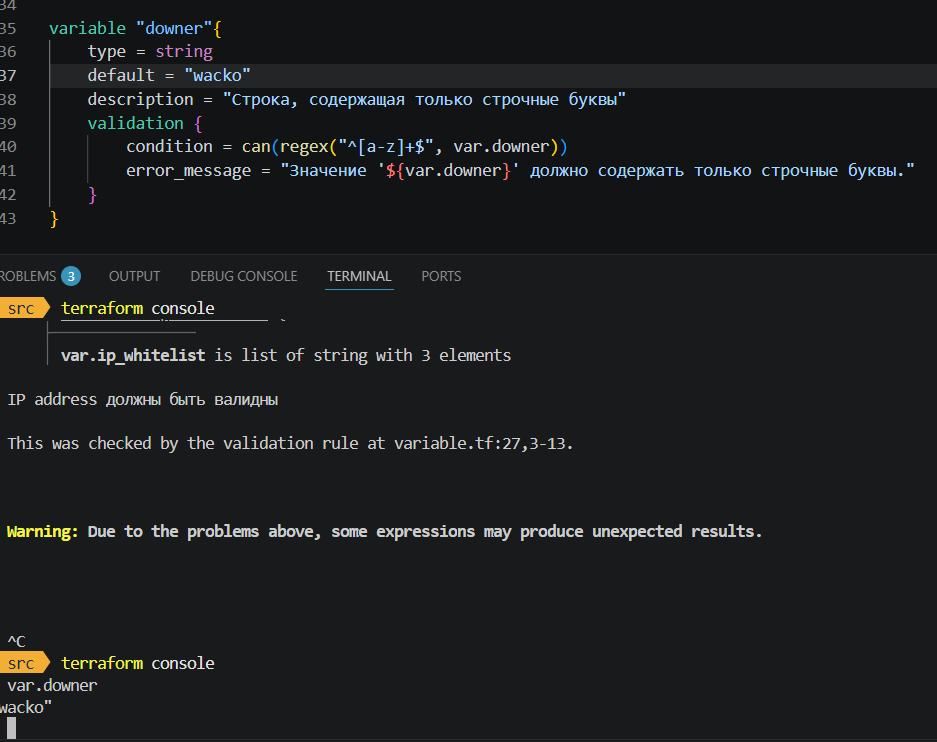
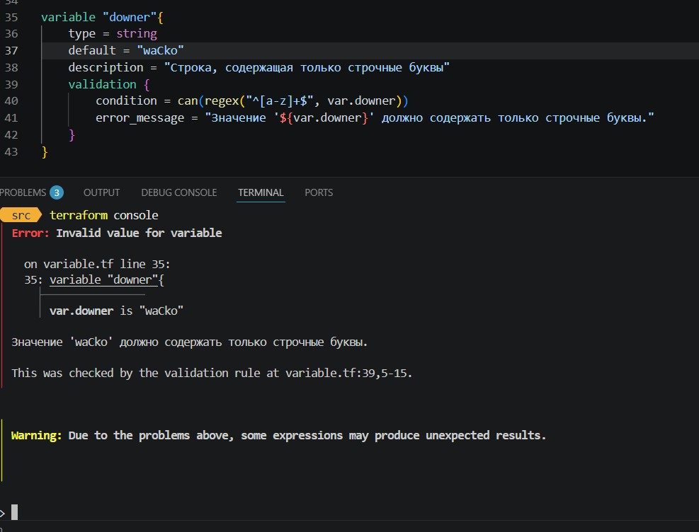

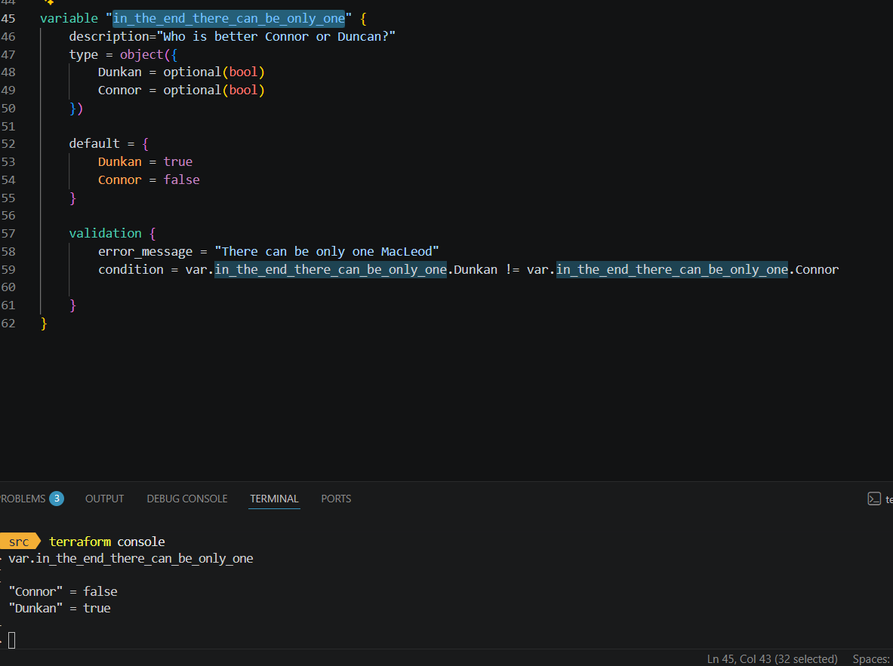
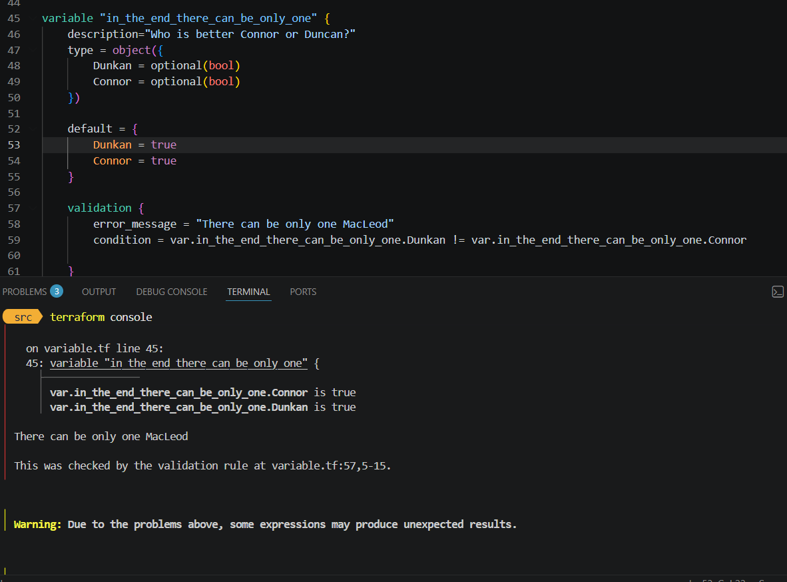
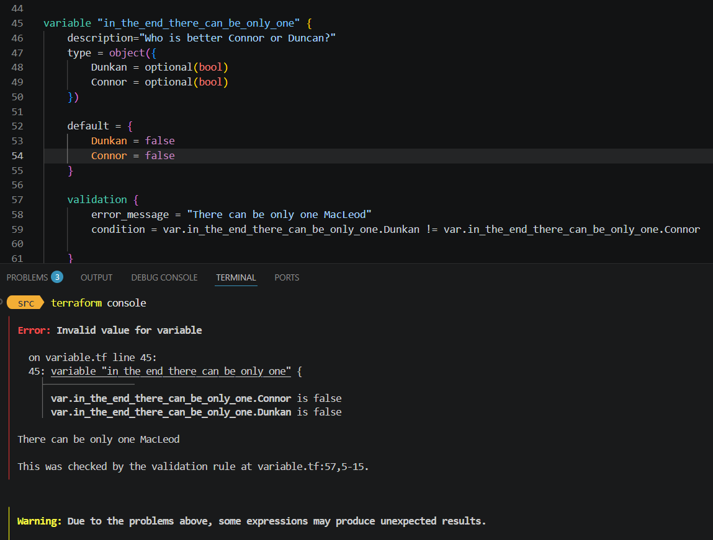